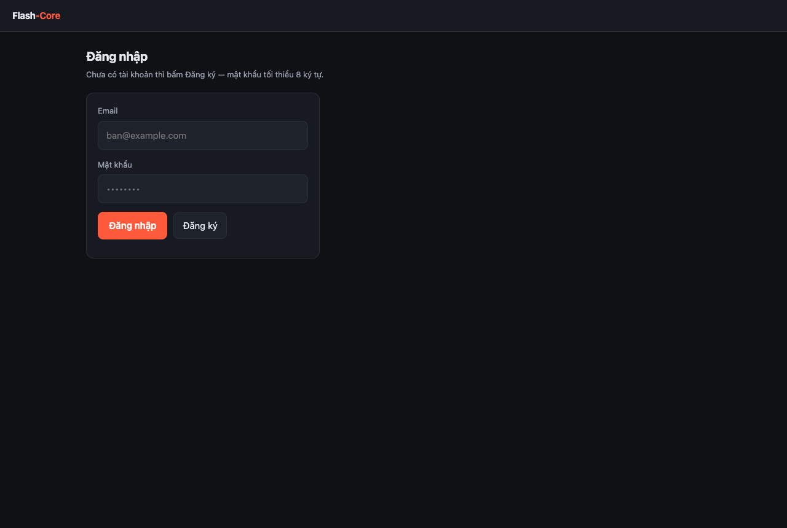
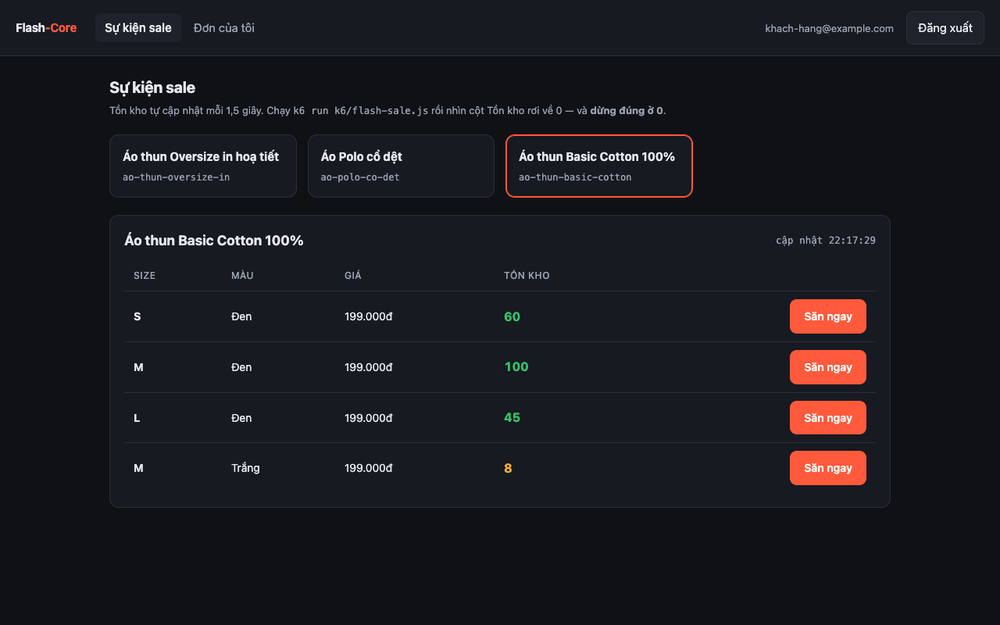
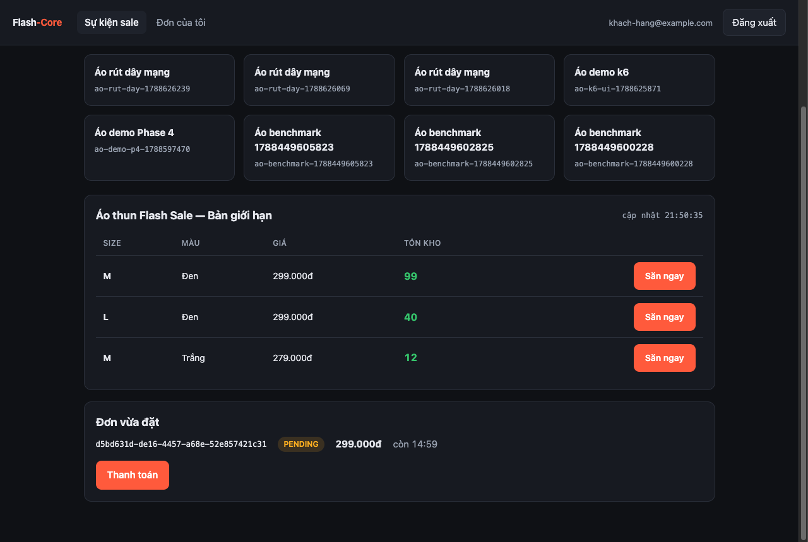
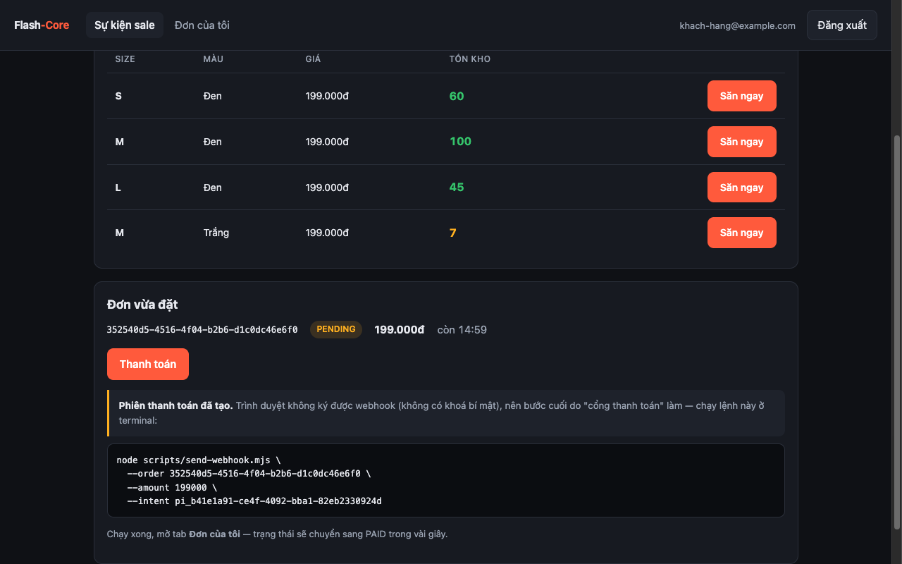
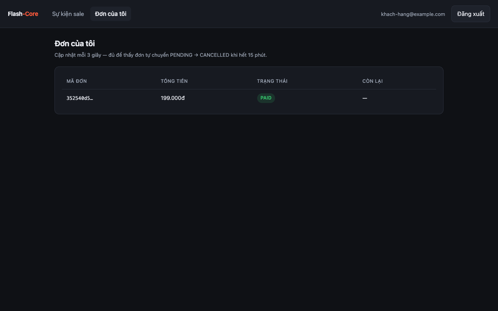
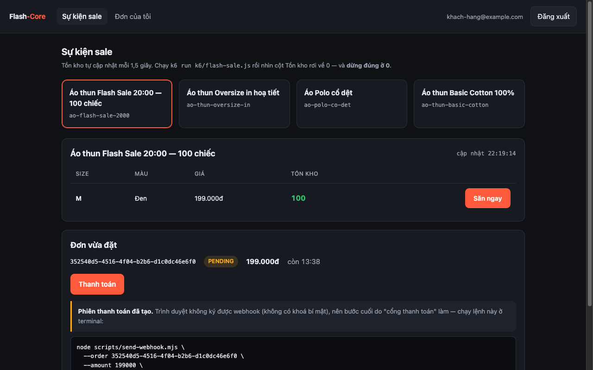
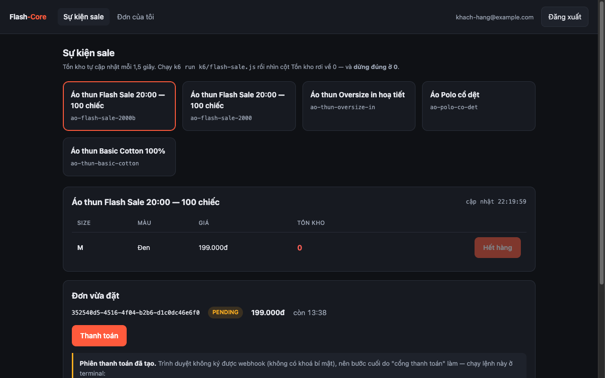

# Demo & thuyết trình dự án khi phỏng vấn

> **File này sở hữu đúng hai thứ:** *tech stack nào giải quyết vấn đề gì*, và *kịch bản đứng
> trước người phỏng vấn*.
>
> Nó **không** chứa kiến thức kỹ thuật — mọi câu "vì sao" trỏ về
> [`tech-playbook.md`](tech-playbook.md), mọi quyết định trỏ về [`adr/`](adr/), mọi con số trỏ
> về [`specs/`](specs/). Nếu thấy mình sắp giải thích một cơ chế ở đây, dừng lại và đặt link.

---

## Phần 0 — Nghiệp vụ và luồng làm việc, nhìn bằng ảnh

> Đọc phần này trước. Không hiểu **app làm gì** thì mọi thứ kỹ thuật phía dưới đều vô nghĩa.

### Nghiệp vụ trong bốn câu

Một shop bán áo thun mở **flash sale**: một mẫu áo, số lượng **giới hạn theo từng biến thể**
(size × màu), mở bán đúng giờ. Hàng nghìn người bấm "Săn ngay" trong vài giây.

Việc khó không phải bán hàng — mà là **bán đúng số lượng có thật**. Còn 100 chiếc thì phải bán
ra **đúng 100**, không phải 101. Bán vượt là mất tiền thật (hoàn đơn, xin lỗi khách) và mất uy
tín; bán thiếu là bỏ doanh thu.

Và vì tiền tham gia vào, hệ thống còn phải trả lời được: đơn chưa trả tiền thì **giữ chỗ bao
lâu**, ai trả tiền rồi mà đơn đã huỷ thì **xử lý sao**, worker chết giữa chừng thì **có mất
việc không**.

### Vòng đời một đơn hàng

Đây là thứ cần thuộc trước khi mở UI — mọi màn hình chỉ là cách nhìn vào một trong ba trạng
thái này:

```
                     ┌──────────────────────────────────────────┐
   bấm "Săn ngay"    │                                          │
  ───────────────►  PENDING  ──── webhook "đã trả tiền" ────►  PAID
   (trừ kho NGAY)    │  giữ chỗ 15 phút                          (kết thúc)
                     │
                     └──── quá 15 phút, chưa trả tiền ────►  CANCELLED
                            (worker tự huỷ + TRẢ HÀNG VỀ KHO)
```

Ba điều đáng chú ý, và cả ba đều là quyết định nghiệp vụ chứ không phải kỹ thuật:

1. **Trừ kho ngay lúc bấm**, không đợi trả tiền. Nếu đợi, hai người cùng "giữ" một chiếc áo và
   người trả tiền sau sẽ mất hàng — tệ hơn nhiều.
2. **Giữ chỗ 15 phút** rồi tự huỷ. Không có nó thì người bấm mà không trả tiền sẽ giam hàng
   vĩnh viễn.
3. **Huỷ thì phải trả hàng về kho**, và trả **đúng một lần**. Trả hai lần là tự sinh ra hàng
   không tồn tại.

### Luồng dùng app — bảy bước, có ảnh thật

#### Bước 1 · Đăng nhập


*Chưa có tài khoản thì bấm **Đăng ký** — nó tự đăng nhập luôn. Token nằm trong cookie
`HttpOnly`, JavaScript không đọc được (đó là chủ đích, chống XSS lấy mất token).*

#### Bước 2 · Màn "Sự kiện sale" — nơi nhìn thấy tồn kho


*Phía trên là lưới **mẫu áo**; bấm một mẫu thì bảng bên dưới hiện các **biến thể (SKU)** của
nó. Mỗi dòng là một tổ hợp **size × màu**, và **tồn kho đếm riêng cho từng dòng** — "áo đen
size M" hết không có nghĩa "áo trắng size M" hết. Con số ở cột Tồn kho **tự cập nhật mỗi 1,5
giây**, nên mở hai tab sẽ thấy chúng đổi cùng nhau.*

#### Bước 3 · Bấm "Săn ngay" → đơn giữ chỗ


*Tồn kho tụt **100 → 99** ngay lập tức, và một đơn `PENDING` hiện ra kèm **đếm ngược 14:59**.
Đơn đã giữ chỗ nhưng **chưa trả tiền**. Nếu hết hàng thì nút chuyển thành "Hết hàng" và bấm sẽ
báo lỗi 409 — đó là trạng thái bình thường của flash sale, không phải lỗi hệ thống.*

#### Bước 4 · Bấm "Thanh toán"


*Trang **không** tự đánh dấu đã trả tiền được — nó chỉ tạo một phiên thanh toán rồi hiện ra
lệnh để copy. **Đó là điểm cần nhấn khi demo**: trình duyệt không giữ khoá bí mật nên không ký
nổi webhook. Nếu nó ký được thì việc verify chữ ký ở phía server là vô nghĩa, và ai cũng đánh
dấu đơn của người khác là "đã trả tiền" được.*

#### Bước 5 · Chạy lệnh đó ở terminal — đóng vai cổng thanh toán

```bash
node scripts/send-webhook.mjs \
  --order <order-id> --amount 299000 --intent <payment-intent-id>
```

Server nhận, **verify chữ ký**, trả `204` ngay rồi đẩy việc nặng vào hàng đợi. Worker xử lý và
đổi đơn sang `PAID`.

#### Bước 6 · Tab "Đơn của tôi" — thấy kết quả


*Trạng thái đã là **PAID**, cột "Còn lại" thành `—` vì đơn không còn đếm ngược nữa. Nếu để đơn
quá 15 phút mà không chạy lệnh trên, chính bảng này sẽ tự chuyển nó sang `CANCELLED` và tồn kho
được cộng trả lại.*

#### Bước 7 · Cảnh đáng giá nhất — 1.000 người bấm cùng lúc

Đây là lý do cả dự án tồn tại. Chọn một mẫu có `stock = 100`:


*Trước khi bắn: tồn kho **100**, nút "Săn ngay" còn bấm được.*

Rồi chạy k6 (1.000 người dùng ảo, mỗi người bấm mua một lần):

```
201 (bán được):    100   ← đúng 100
409 (hết hàng):    900   ← trạng thái nghiệp vụ, KHÔNG phải lỗi
4xx khác:          0
5xx:               0
```


*Sau **một giây**: tồn kho **0** màu đỏ, nút thành "Hết hàng", và **dừng đúng ở 0** — không có
nhịp cập nhật nào hiện số âm. Bán ra đúng 100 chiếc trên 1.000 người bấm.*

### Demo trên terminal — bốn cảnh, và chúng mạnh hơn UI

Giao diện cho thấy **cái gì** xảy ra. Terminal cho thấy **vì sao tin được**. Bốn output dưới
đây là kết quả chạy thật, copy nguyên văn.

#### Cảnh 1 · k6 — 1.000 người bấm, bán ra đúng 100

```console k6 run k6/flash-sale.js
     execution: local
        script: k6/flash-sale.js

     scenarios: (100.00%) 1 scenario, 1000 max VUs, 1m30s max duration
              * flash_sale: 1 iterations for each of 1000 VUs

running (0m01.0s), 0340/1000 VUs, 660 complete and 0 interrupted iterations
running (0m02.0s), 0079/1000 VUs, 921 complete and 0 interrupted iterations

=== Kết quả benchmark ===
Chiến lược:        optimistic
Pool max:          10
201 (bán được):    100   ← phải đúng 100
409 (hết hàng):    900   ← bình thường, KHÔNG phải lỗi
4xx khác:          0   ← phải 0
5xx:               0   ← phải 0
p95 (ms):          2078.8
throughput (rps):  470.0

flash_sale ✓ [ 100% ] 1000 VUs  0m02.1s/1m0s  1000/1000 iters, 1 per VU
```

**Chỗ cần chỉ tay vào:** bốn dòng đếm riêng 201 / 409 / 4xx / 5xx. Gộp chúng lại thành một
"error rate" thì báo cáo sẽ ghi **90% lỗi** trong khi hệ thống hoạt động hoàn hảo — 900 lần
409 là *hết hàng*, đúng như kỳ vọng khi chỉ có 100 chiếc.

#### Cảnh 2 · Một `correlationId` đi xuyên hai tiến trình

Đặt đơn với một id do mình tự đặt:

```bash
curl -X POST localhost:3000/orders \
  -H 'x-correlation-id: don-hang-20h00-cua-khach' \
  -H "Idempotency-Key: $(uuidgen)" \
  -d '{"skuId":"...","quantity":1}'
```

Rồi tìm nó trong log của **cả hai** tiến trình:

```bash
grep don-hang-20h00-cua-khach api.log worker.log
```

```console grep don-hang-20h00-cua-khach api.log worker.log
[API]     OrderService      Đặt đơn thành công
[API]                       POST /orders → 201 (16ms)
[WORKER]  LoggingMailSender Gửi email (bản log của Phase 4)
```

**Chỗ cần chỉ tay vào:** dòng thứ ba đến từ **một process khác**, chạy **sau khi request đã
kết thúc từ lâu** — mà vẫn mang đúng id đó. Không có nó thì khi khách báo "tôi đặt hàng lúc 8
giờ tối, bị lỗi", việc tra log là lọc theo mốc thời gian giữa hàng nghìn dòng của hàng trăm
request đan xen. Có nó thì một lệnh `grep` ra đủ chuỗi.

#### Cảnh 3 · Giết Redis — `/ready` chết, `/health` sống

```bash
docker stop flashcore-redis
curl -o /dev/null -w "ready:  %{http_code}\n" localhost:3000/ready
curl -o /dev/null -w "health: %{http_code}\n" localhost:3000/health
```

```console docker stop flashcore-redis
ready:  503
health: 200
```

```json
{
  "code": "NOT_READY",
  "message": "Instance chưa sẵn sàng nhận traffic",
  "details": { "database": "up", "redis": "down", "shuttingDown": false },
  "correlationId": "9da35d22-03eb-4da0-8117-d4a76ed202f2"
}
```

**Chỗ cần chỉ tay vào:** `/health` **vẫn 200**. Hai endpoint trả lời hai câu khác nhau —
*"có nên gửi traffic vào đây không"* và *"process còn sống không"*. Gộp chúng lại là lỗi cấu
hình đắt nhất khi deploy: `/health` fail sẽ khiến orchestrator **restart container**, mà
restart app thì không chữa được Redis — chỉ thêm thời gian khởi động vào giữa sự cố.

#### Cảnh 4 · Hệ thống tự báo cáo về chính nó

```bash
curl -s localhost:3000/metrics | grep -E "^orders_placed_total|^outbox_pending"
```

```console curl -s localhost:3000/metrics | grep …
orders_placed_total{result="created"} 1
inventory_reserve_duration_seconds_count{strategy="optimistic"} 1
outbox_pending 0
```

**Chỗ cần chỉ tay vào:** nhãn `result` và `strategy`. Một metric `http_requests_total{status="409"}`
chỉ nói *"có 409"*; nó không phân biệt được **hết hàng** với **SKU không tồn tại** — nên metric
nghiệp vụ phải đếm ở trong service, nơi biết lý do. Và `outbox_pending` tăng đều nghĩa là relay
đã chết, nhìn thấy được rất lâu trước khi có ai báo "không nhận được email".

> **Cảnh thứ năm — "rút dây mạng"** — nằm ở [Phần 3](#phút-57--rút-dây-mạng--phần-thuyết-phục-nhất)
> vì nó cần vài phút thao tác. Đó là cảnh mạnh nhất trong cả buổi demo: giết worker giữa
> chừng, bật lại, rồi đếm ra **20 / 0 / 20**.

### Ai làm gì phía sau — ba thành phần

| Thành phần | Chạy bằng lệnh | Việc của nó |
|---|---|---|
| **API** | `npm run dev` | Nhận request, trừ kho, tạo đơn, verify chữ ký webhook. Phục vụ luôn trang web ở `localhost:3000` |
| **Worker** | `npm run worker` | Chạy nền, **không** phục vụ HTTP: gửi email, tự huỷ đơn quá hạn, xử lý sự kiện thanh toán |
| **Postgres + Redis** | `npm run up` | Postgres giữ **sự thật** về tồn kho; Redis giữ hàng đợi việc và bộ đếm rate limit |

Thiếu worker thì app vẫn đặt được đơn — nhưng đơn sẽ **không bao giờ** tự huỷ, và email không
bao giờ gửi. Đó là lý do demo phải mở hai terminal.

---

## Phần 1 — Dự án là gì, nói trong ba độ dài

Người phỏng vấn hỏi "kể về dự án của em" bằng ba kiểu, và mỗi kiểu cần một câu trả lời khác
nhau về **độ dài**, không phải về nội dung. Chuẩn bị sẵn cả ba.

### 30 giây — khi họ mới mở CV ra

> "Em làm một API engine cho hệ thống **săn flash sale áo thun**. Bài toán cốt lõi là
> **concurrency**: một mẫu áo có 100 chiếc, 1.000 người bấm 'Săn ngay' trong 3 giây, và
> **phải bán ra đúng 100 — không phải 101**.
>
> Em làm **ba** chiến lược chống bán vượt, đổi bằng một biến môi trường, rồi **đo bằng k6**
> để so sánh. Cả ba đều cho bán vượt bằng 0, nhưng số đo có **ba kết quả ngược trực giác** —
> đó là phần em học được nhiều nhất."

Câu cuối là **cái móc**. Người phỏng vấn tử tế sẽ hỏi "ngược trực giác thế nào?" — và lúc đó
anh đang ở trên sân của mình.

### 3 phút — câu trả lời mặc định

Đi theo đúng bốn bước này, đừng kể theo thứ tự phase:

| Bước | Nói gì | Chi tiết ở |
|---|---|---|
| 1. **Bài toán** | Flash sale: tồn kho giới hạn **theo SKU biến thể** (size × màu), nghìn người cùng bấm. Bán vượt = mất tiền thật + mất uy tín; bán thiếu = bỏ doanh thu | — |
| 2. **Vì sao nó khó** | `if (stock > 0) stock--` **chắc chắn** sai, không phải hiếm khi sai. Và **database không báo lỗi gì cả** — nó không hỏng, nó chỉ *sai* | [playbook §Phase 3](tech-playbook.md) |
| 3. **Cách em giải** | Đưa điều kiện vào **chính câu ghi**: `UPDATE … WHERE stock >= ?`. An toàn ngay ở Read Committed, không cần đổi isolation level | [playbook §Phase 3](tech-playbook.md) |
| 4. **Bằng chứng** | 200 request song song → đúng 100 đơn, **ở cả ba chiến lược**. k6 1.000 VU → bán vượt = 0 ở cả bốn cấu hình | [spec Phase 3](specs/phase3-order-concurrency.md) |

Dừng ở đây. Đừng kể tiếp Phase 4, 5, 6 nếu họ chưa hỏi — kể hết một lượt là mất cơ hội để họ
đào sâu vào chỗ mạnh nhất.

### 10 phút — khi họ nói "kể chi tiết đi"

Thêm đúng **ba câu chuyện** ở [Phần 4](#phần-4--ba-câu-chuyện-đáng-kể-nhất) — mỗi câu chuyện
là một **bug thật** kèm số liệu. Không thêm tính năng, thêm câu chuyện.

---

## Phần 2 — Tech stack: mỗi thứ giải quyết vấn đề gì

Đây là bảng để trả lời câu **"vì sao em chọn cái này?"** — câu mà người phỏng vấn dùng để phân
biệt người *chọn có lý do* với người *chọn theo trend*.

| Công nghệ | Trong dự án nó làm gì | Vì sao nó, không phải cái khác |
|---|---|---|
| **NestJS** | Khung cho **Modular Monolith**: DI container ép ranh giới module ở tầng máy | Express thuần thì ranh giới module chỉ là quy ước, và DI phải tự dựng. NestJS **chạy trên** Express — không phải hai lựa chọn loại trừ nhau |
| **TypeScript** strict | Bắt lỗi ở compile-time, và code tự tài liệu hoá | — |
| **Zod** (không class-validator) | Validate ở biên; **type suy ra TỪ schema** nên không bao giờ lệch | class-validator cần decorator + `class-transformer`, và type khai hai lần ⇒ lệch được. [ADR-002](adr/002-nen-mong-ky-thuat-phase-0.md) |
| **PostgreSQL 16** | Nơi **duy nhất** biết sự thật về tồn kho. Ba cơ chế dùng thật: `UPDATE … WHERE`, `SELECT FOR UPDATE`, `FOR UPDATE SKIP LOCKED` | Đây là công cụ chống bán vượt. Không có nó thì bài toán trở thành distributed transaction — khó hơn nhiều và **không dạy được điều đang muốn học** |
| **Prisma 7** + `@prisma/adapter-pg` | ORM, nhưng `pg.Pool` **do mình cấu hình** | Pool trở thành biến điều khiển được (`DATABASE_POOL_MAX`) — cần cho benchmark Phase 3, và cho Neon pooler ở Phase 7 |
| **`$queryRaw`** ở đúng 1 file | `SELECT FOR UPDATE` và `UPDATE … WHERE stock >= ?` | Prisma **không có API** cho `FOR UPDATE`. Đây là "chạm giới hạn của ORM" — chọn có ý thức, và giới hạn lại trong một file ([ADR-003](adr/003-so-huu-logic-tru-ton-kho.md)) |
| **Redis** | Rate limit đăng nhập, và chiến lược chống bán vượt thứ ba (**Lua** kiểm-tra-và-trừ) | Phải là Lua: Redis chạy lệnh tuần tự một luồng nên script chạy trọn vẹn. `GET` rồi `DECRBY` từ Node chỉ **đổi chỗ** race condition |
| **BullMQ** | Hàng đợi, delayed job (huỷ đơn 15 phút), DLQ | Trên Redis đã có sẵn. **Không cần Kafka** — xem mục dưới |
| **Outbox pattern** | Chống **dual write**: sự kiện ghi cùng transaction với đơn | `await db.save()` rồi `await queue.add()` mà chết ở giữa thì mất việc, và `try/catch` không cứu được. [ADR-006](adr/006-relay-giu-transaction-khi-day-queue.md) |
| **Argon2id** | Băm mật khẩu | **Memory-hard** (19 MiB/lần) — GPU không song song hoá được như với bcrypt (chỉ tốn CPU) |
| **HttpOnly Cookie** + rotation | Access + refresh token, phát hiện token bị đánh cắp | JS không đọc được cookie ⇒ XSS không lấy được token. Rotation: **dù ai dùng trước, lần thứ hai luôn lộ** |
| **Jest + Testcontainers** | Integration test trên **Postgres/Redis thật** | Race condition **không tồn tại trong thế giới của mock**. Đây là lý do một hệ thống có coverage 92% vẫn bán vượt |
| **k6** | Load test 1.000 VU, đếm **riêng** 201/409/4xx/5xx | Trộn 4xx với 5xx làm error rate mất hết ý nghĩa: 900 lần 409 là kết quả **đúng**, không phải lỗi |
| **prom-client** | 6 metric tự khai + bộ mặc định của Node, tại `GET /metrics` | Metric trả lời *"đang có bao nhiêu"*; log trả lời *"chuyện gì đã xảy ra"*. Hai câu khác nhau, hai công cụ |
| **Pino** + `AsyncLocalStorage` | `correlationId` đi xuyên **cả worker** | Truyền qua tham số thì chỉ cần **một chỗ quên là đứt chuỗi**, và chỗ quên đó không test nào bắt được. [ADR-008](adr/008-correlationid-dung-asynclocalstorage.md) |
| **Trang tĩnh 1 file** cho UI | Nhìn thấy tồn kho rơi về 0 theo thời gian thực | FE ở đây là **công cụ trực quan hoá**, không phải sản phẩm. Vite+React lấy thời gian từ Phase 6 — thứ thật sự cộng điểm cho CV backend. [ADR-007](adr/007-ui-la-trang-tinh-mot-file.md) |

### Phần ghi điểm nhất: những gì **cố tình không dùng**

`project-context.md` ghi nguyên văn: *"người phỏng vấn giỏi phát hiện 'resume-driven
development' trong 2 câu hỏi"*. Vì vậy chuẩn bị sẵn câu trả lời cho **câu ngược**:

| Họ hỏi | Nói gì |
|---|---|
| "Sao không dùng **Kafka**?" | "Bài toán của em là **một** hệ thống, một database. Kafka giải bài toán *nhiều* consumer group và replay lịch sử — em chưa có nhu cầu đó. BullMQ trên Redis đã có sẵn làm đủ delayed job, retry, DLQ. Thêm Kafka là thêm một hạ tầng phải nuôi mà chưa chống được vấn đề nào có thật." |
| "Sao không **microservices**?" | "Vì em sẽ **mất transaction và lock của một database** — đúng hai công cụ em dùng để chống bán vượt. Bài toán oversell trong hệ phân tán là bài toán *khác hẳn*: saga, reservation token. Em chọn Modular Monolith có ranh giới **ép bằng máy** (DI + ESLint), nên vẫn có sẵn đường cắt nếu sau này thật sự cần tách." |
| "Sao không **Kubernetes**?" | "Một service, một người, ràng buộc chi phí 0đ. Cloud Run scale-to-zero là đúng công cụ. K8s ở quy mô này là chi phí vận hành không đổi lấy được gì." |
| "Sao **UI không dùng React**?" | "FE ở đây là công cụ trực quan hoá, không phải sản phẩm — [ADR-007](adr/007-ui-la-trang-tinh-mot-file.md) ghi rõ cái được và cái mất. Em đánh đổi một dòng React trong CV để lấy thời gian cho observability." |

Ba câu này quan trọng vì chúng cho thấy anh **biết công nghệ đó tồn tại, biết nó giải bài toán
gì, và biết bài toán đó không phải của mình** — khác hẳn với "em chưa dùng".

Danh sách đầy đủ những gì đã loại bỏ: [`project-context.md` §3](../project-context.md).

---

## Phần 3 — Kịch bản demo live, 8 phút

> Toàn bộ lệnh dưới đây **đã chạy thật** trên môi trường dev. Nhưng luật số một của demo:
> **chạy thử trọn kịch bản một lần ngay trước buổi phỏng vấn.** Máy khác, mạng khác, và
> Docker có thói quen ngủ đúng lúc cần nhất.

### Chuẩn bị (làm trước, không làm trong buổi)

```bash
npm run up && npx prisma migrate deploy && npm run build
npm run dev                # terminal 1
npm run worker             # terminal 2
node k6/seed-target.js     # terminal 3 — in ra lệnh k6 kèm SKU_ID và TOKEN
```

Bố trí màn hình: **trình duyệt bên trái** (trang `localhost:3000`, đã đăng nhập, đã chọn áo),
**terminal bên phải**. Người xem phải thấy được cả hai cùng lúc — đó là toàn bộ sức mạnh của
demo này.

### Phút 0–1 · Bài toán, bằng một màn hình

Mở trang, chỉ vào cột **Tồn kho**.

> "Đây là một mẫu áo còn 100 chiếc. Số này tự cập nhật mỗi 1,5 giây. Bây giờ em sẽ cho
> **1.000 người bấm mua trong một giây** — và anh nhìn con số này."

### Phút 1–3 · Chạy k6, để con số tự kể

```bash
.tools/k6 run -e SKU_ID=<id> -e TOKEN=<token> \
  -e STRATEGY=optimistic -e POOL_MAX=10 k6/flash-sale.js
```

Đừng nói gì trong ~2 giây đó. Để họ nhìn con số rơi.

```console k6 — 1.000 VU vào SKU có stock = 100
201 (bán được):    100   ← phải đúng 100
409 (hết hàng):    900   ← bình thường, KHÔNG phải lỗi
4xx khác:          0
5xx:               0
```

> "Bán ra **đúng 100**. Chín trăm request còn lại nhận **409 Conflict** — hết hàng. Đó là
> trạng thái nghiệp vụ, **không phải lỗi hệ thống**, nên em đếm chúng riêng. Nếu trộn 4xx với
> 5xx thì báo cáo này sẽ ghi 'error rate 90%' trong khi **không có gì hỏng cả**."

Rồi chỉ lại trang web: tồn kho **0**, nút thành "Hết hàng", **dừng ở 0**.

### Phút 3–5 · Vì sao nó đúng, bằng bốn dòng SQL

```sql
UPDATE product_skus
SET stock = stock - $1, version = version + 1, updated_at = now()
WHERE id = $2 AND is_active = true AND stock >= $1
RETURNING price_vnd
```

> "Cả bài học nằm ở dòng thứ ba: điều kiện `stock >= $1` nằm **bên trong chính câu ghi**.
> Khi câu này gặp một dòng đang bị khoá, Postgres **chờ, rồi đánh giá lại `WHERE` trên phiên
> bản mới nhất** — nên điều kiện không bao giờ được kiểm tra trên dữ liệu cũ. Nó đúng ngay ở
> Read Committed, **không** cần đổi isolation level."

Nếu họ hỏi *"thế cột `version` để làm gì?"* — đó là câu hỏi tốt: cột đó **không bắt buộc** để
chống bán vượt; nó cần khi update nhiều field phụ thuộc nhau.

### Phút 5–7 · "Rút dây mạng" — phần thuyết phục nhất

Đây là phần khác biệt: không phải "em có làm queue", mà **"em chứng minh được nó không mất dữ
liệu"**.

```bash
# 20 đơn đặt khi worker đang TẮT ⇒ 20 sự kiện nằm ở outbox
# bật worker, Ctrl+C sau ~1 giây, bật lại
```

Rồi chạy câu đếm ([lệnh đầy đủ ở onboarding Buổi 3](onboarding.md)):

```console psql — đếm sau khi giết worker giữa chừng
so_don          = 20
outbox_con_cho  =  0     ← không sự kiện nào kẹt ⇒ KHÔNG MẤT
email_da_gui    = 20     ← đúng một dấu mỗi đơn ⇒ KHÔNG TRÙNG
```

> "Em giết worker giữa lúc nó đang xử lý. Bật lại thì đủ 20 email, **không phải 21**. `21` là
> gửi trùng, `19` là mất — cả hai đều phá lời hứa của hệ thống. Hai con số này mới là bằng
> chứng, không phải 'log nhìn có vẻ ổn'."

### Phút 7–8 · Nhìn được vào bên trong

```bash
curl -s localhost:3000/metrics | grep -E "^orders_placed_total|^outbox_pending"
curl -s localhost:3000/ready | python3 -m json.tool
docker stop flashcore-redis && curl -s -o /dev/null -w "ready:%{http_code}\n" localhost:3000/ready
curl -s -o /dev/null -w "health:%{http_code}\n" localhost:3000/health
docker start flashcore-redis
```

> "`/ready` trả **503**, nhưng `/health` vẫn **200**. Hai endpoint trả lời hai câu khác nhau:
> `/ready` là 'có nên gửi traffic vào đây không', `/health` là 'process còn sống không'. Gộp
> chúng lại là lỗi cấu hình đắt nhất khi deploy — vì `/health` fail sẽ khiến orchestrator
> **restart container**, mà restart app thì không chữa được Redis."

### Phương án B — khi không demo live được

Rất hay xảy ra: phỏng vấn online, không share được máy, hoặc máy họ cấp. Chuẩn bị sẵn:

1. **Video/GIF 2 phút** — cảnh k6 chạy và tồn kho rơi về 0 (deliverable của Phase 5).
2. **Mở [`docs/html/hoc/index.html`](html/hoc/index.html)** — sơ đồ vòng đời đơn hàng và cơ chế từng
   phase. Chỉ vào sơ đồ mà nói, đừng đọc chữ.
3. **Bảng số của Phase 3** — [spec §Bằng chứng test #16](specs/phase3-order-concurrency.md).

---

## Phần 4 — Ba câu chuyện đáng kể nhất

Người phỏng vấn nghe "em làm được X" cả ngày. Thứ họ nhớ là **"em làm sai X, và đây là cách
em phát hiện ra"**. Ba câu chuyện dưới đây đều là bug thật của repo này, có commit làm chứng.

### 1. Pattern viết đúng tên nhưng sai thứ tự — và không test nào đỏ

> "Em làm Outbox pattern để chống dual write. Bản đầu em ghi: khoá dòng, đánh dấu
> `DISPATCHED`, **commit**, rồi mới đẩy vào queue. Nhìn thì đúng hoàn toàn, và **toàn bộ test
> đều xanh**.
>
> Nhưng nếu process bị giết đúng khe giữa commit và lệnh đẩy, dòng đó nằm lại `DISPATCHED`
> vĩnh viễn — không ai đẩy nữa, và **không ai biết**. Tức là vẫn **mất** dữ liệu, đúng thứ
> Outbox sinh ra để chống.
>
> Em sửa thành đẩy trước, đánh dấu sau, **trong cùng một transaction** — hỏng ở đâu cũng
> rollback về `PENDING`. Và em thêm một test mô phỏng đúng cú chết đó, vì bài học thật là:
> **loại lỗi này không tự lộ ra, phải có test cố tình gây ra nó.**"

Chi tiết: [ADR-006](adr/006-relay-giu-transaction-khi-day-queue.md) · test `4b` trong
`test/async-payment.e2e-spec.ts`

### 2. Ba kết quả benchmark ngược trực giác

> "Em đo ba chiến lược bằng k6 1.000 VU, và **cả ba kết quả đều ngược** với những gì em đoán:
>
> **Pessimistic nhanh nhất** — vì 900/1.000 request rơi vào 'hết hàng'. Ca đó pessimistic tốn
> **một** round-trip, còn optimistic tốn **hai**. Đường đi phổ biến nhất lại là đường tốn gấp đôi.
>
> **Pool 50 chậm hơn pool 10** — nới pool chỉ *chuyển* phần chờ khoá từ hàng đợi trong app
> (rẻ) vào bên trong Postgres (đắt). Bài học: xếp hàng bên ngoài DB, đừng dồn vào trong DB.
>
> **Redis chưa nhanh hơn** — vì lúc đó em vẫn ghi DB đồng bộ trong request. Ưu thế của nó chỉ
> hiện ra khi có outbox. Số hôm đó là **mốc để so sánh sau**, không phải kết luận."

Chi tiết: [playbook §Phase 3 → Số thật đo được](tech-playbook.md)

### 3. "Cực hiếm" là phỏng đoán, phải kiểm bằng cách dùng thật

> "Em viết hàm sinh mã SKU, cắt slug còn 16 ký tự, và để lại comment ghi rằng trùng mã là
> 'cực hiếm'. Đến khi chạy benchmark, script seed dùng slug `ao-benchmark-<timestamp>` —
> 16 ký tự đầu cắt đúng chỗ timestamp, nên **mọi lần chạy thứ hai đều lỗi 500**.
>
> 'Cực hiếm' là một phỏng đoán về tần suất, và phỏng đoán thì phải kiểm bằng cách dùng thật.
> Em sửa bằng 4 ký tự băm và thêm test cho đúng ca đó."

---

## Phần 5 — Câu hỏi kỹ thuật họ sẽ hỏi

**Không lặp lại ở đây.** Toàn bộ đáp án đã có:

- [`tech-playbook.md` §Ôn phỏng vấn — 12 câu chốt](tech-playbook.md) — bảng "câu phải nói được"
- Mỗi phase có mục *Câu hỏi bản chất — và đáp án* trong cùng file
- Mỗi trang [`hoc/phase-N.html`](html/hoc/index.html) có mục **"Bị chỉ vào — trả lời thế nào"** với
  đáp án gập lại

Ôn theo đúng thứ tự đó: đọc câu hỏi → tự nói ra → **rồi mới** mở đáp án.

---

## Phần 6 — Bốn cái bẫy khi thuyết trình

**1. Kể theo thứ tự phase.** Người phỏng vấn không quan tâm Phase 0 làm gì. Kể theo *bài toán →
vì sao khó → cách giải → bằng chứng*. Thứ tự phase là thứ tự **anh làm**, không phải thứ tự
**họ hiểu**.

**2. Nói "em dùng Redis, BullMQ, Prometheus…" như đọc danh sách.** Mỗi công nghệ phải đi kèm
*vấn đề nó giải*. Đọc danh sách nghe giống resume-driven development, và đó là điều Phần 2 tồn
tại để tránh.

**3. Che chỗ chưa làm.** Phase 7 chưa deploy, coverage chưa đạt 70%, RBAC vẫn là nợ. Nói thẳng
**kèm lý do đã ghi lại** thì đó là điểm cộng: nó cho thấy anh phân biệt được *nợ có ghi chép*
với *nợ bị quên*. Danh sách: [`CLAUDE.md` §Trạng thái hiện tại](../CLAUDE.md).

**4. Nhận công phần AI viết.** Dự án này AI viết phần lớn code, và điều đó **ghi công khai
trong README**. Cách nói đúng: *"em viết spec, review từng dòng và ra quyết định kiến trúc;
code do AI viết theo spec đó"* — rồi chứng minh bằng 8 ADR, mỗi cái có ghi **cả lựa chọn đã bị
loại và vì sao**. Người phỏng vấn 2026 quan tâm anh **kiểm soát** được AI tới mức nào, hơn là
anh gõ được bao nhiêu dòng.

---

## Checklist 10 phút trước khi vào phòng

- [ ] `npm run up` · `npx prisma migrate deploy` · `npm run build` — chạy sạch
- [ ] `npm run dev` và `npm run worker` — cả hai đang chạy
- [ ] `node k6/seed-target.js` — đã có `SKU_ID` và `TOKEN` dán sẵn vào lệnh k6
- [ ] Trang `localhost:3000` mở sẵn, đã đăng nhập, đã chọn áo, thấy tồn kho 100
- [ ] Đã **chạy thử trọn kịch bản một lần** và thấy `201=100 · 409=900 · 5xx=0`
- [ ] Video 2 phút mở sẵn trong tab khác (phương án B)
- [ ] [`docs/html/hoc/index.html`](html/hoc/index.html) mở sẵn trong tab khác (phương án B)
