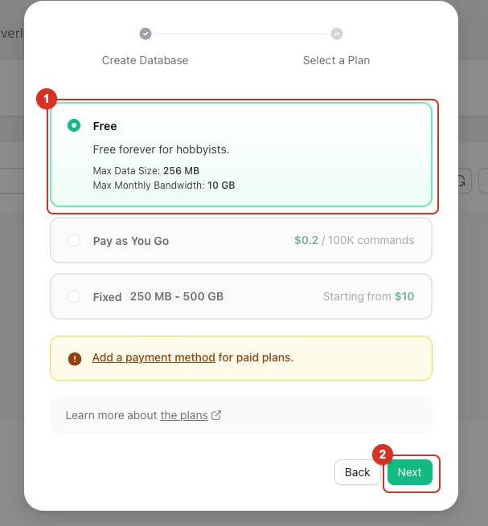
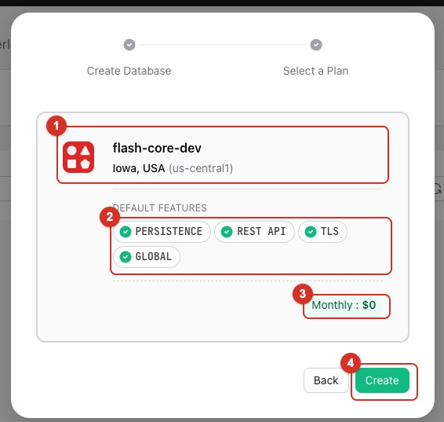
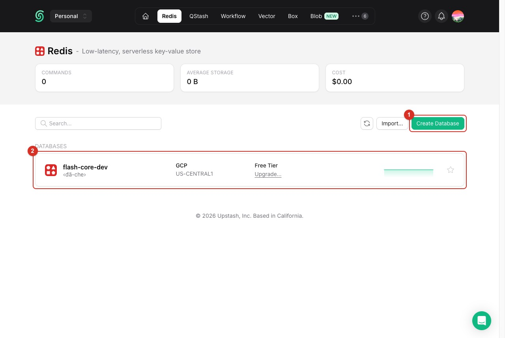
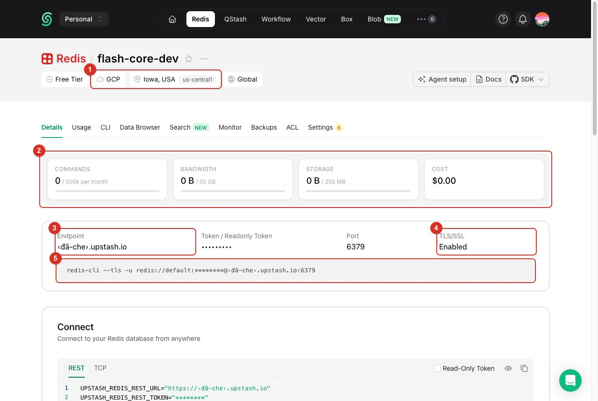
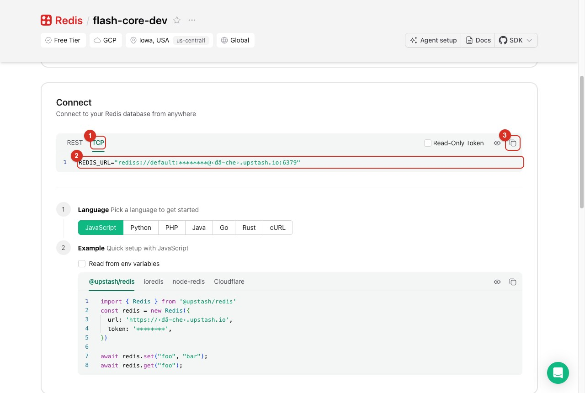
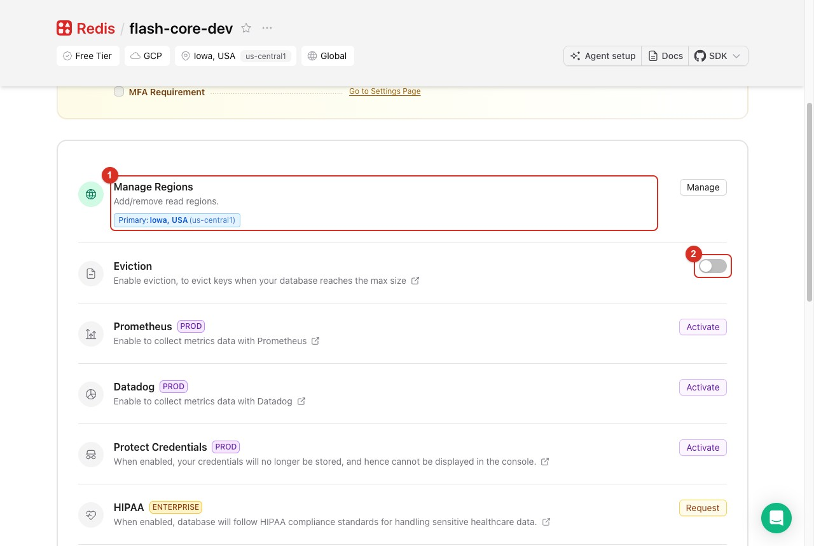
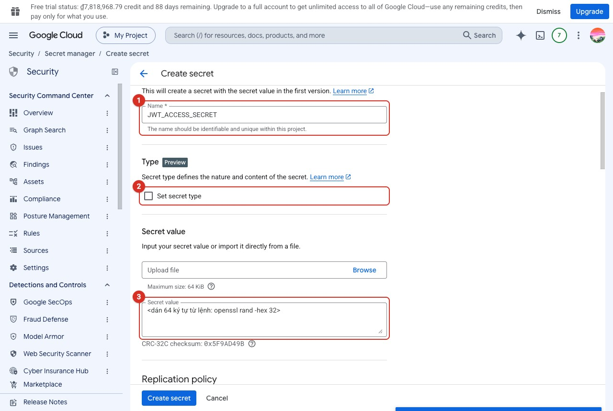
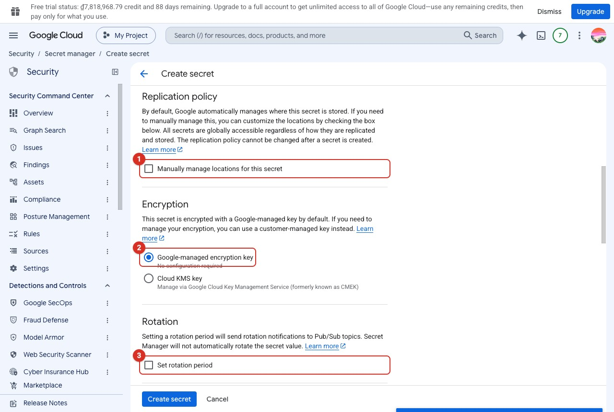
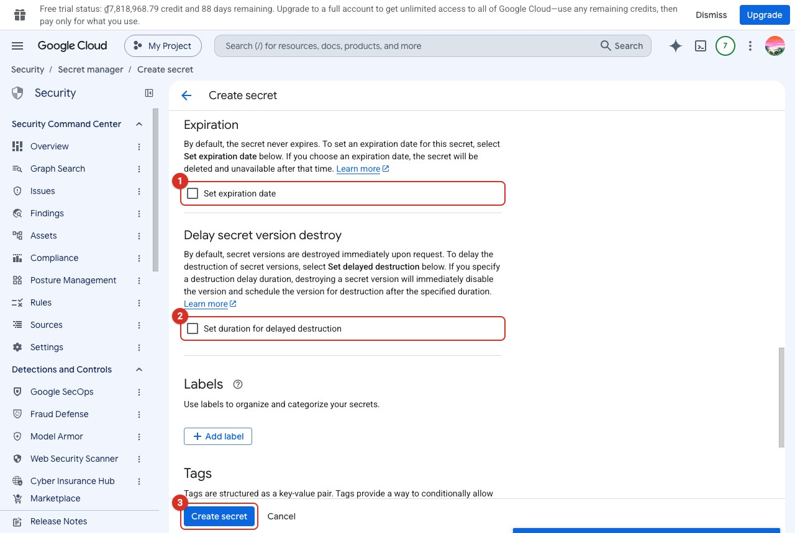

# Hướng dẫn deploy lên GCP — từ con số không

> **Dành cho người lần đầu deploy.** File này làm mọi bước bằng **Console (UI)** — bấm trên
> console.cloud.google.com. **Lệnh `gcloud` tương đương nằm ở file riêng: [Deploy bằng lệnh](huong-dan-deploy-gcp-lenh.md)**
> — cùng số mục, dùng khi phải dựng lại nhanh. Mỗi bước chọn **một** trong hai cách, đừng làm cả hai.
>
> **Cách đọc mỗi mục:** phần trên chỉ có **các bước + ảnh chụp** — làm theo là xong. Mục con
> **cuối cùng** tên là ***Vì sao cấu hình như vậy***: giải thích từng lựa chọn, theo mẫu *chọn gì →
> vì sao → chọn khác thì sao*. Lần đầu nên đọc cả hai; lần dựng lại thì chỉ cần phần trên.
>
> **Tên nút trên Console đổi theo thời gian.** Các màn Budget, Cloud SQL, Artifact Registry,
> Workload Identity và tạo service account đã được **đối chiếu trên Console thật ngày
> 2026-09-26**. Chỗ chưa xem được trên Console thật (vì API của nó chưa bật) thì dựa theo tài liệu
> chính thức và có dấu ⚠. Không thấy đúng chữ thì gõ tên dịch vụ vào ô tìm kiếm trên cùng.
>
> **Mở một dịch vụ mà API của nó chưa bật** thì Console tự chuyển sang trang có nút **Enable** —
> bấm Enable ở đó là đúng (tương đương bước 3 của §2).
>
> **Giả định:** đã có tài khoản GCP với **$300 credit / 90 ngày**. Hướng dẫn này tận dụng
> credit đó, và §16 nói rõ phải đổi gì khi credit hết.
>
> **Hai môi trường ([ADR-017](adr/017-moi-truong-va-phan-quyen-theo-mo-hinh-cong-ty.md)).** §1–§17
> dựng **một** môi trường. Làm **hai lần**: project `flash-core-dev` trước, `flash-core-prod`
> sau — cùng các bước, chỉ khác tên project. §18 nói phần khác nhau (nhóm quyền, người duyệt,
> tag). Chỉ muốn một môi trường thì làm prod và bỏ qua §18.
>
> Quyết định kiến trúc đứng sau mỗi lựa chọn: [ADR-012](adr/012-worker-tren-cloud-run.md)
> (worker) · [ADR-013](adr/013-pool-nho-tren-serverless.md) (pool) ·
> [ADR-014](adr/014-workload-identity-federation.md) (xác thực CI) ·
> [ADR-016](adr/016-cloud-sql-thay-neon.md) (Cloud SQL, chạy liên tục trong giai đoạn credit).
> Phép tính FinOps đầy đủ: [spec Phase 7](specs/phase7-deploy-gcp.md).

---

<!--@@muc-luc-->

---

<!--@@chuong Chuẩn bị — hiểu bức tranh, chặn tiền trước-->
## 0. Bức tranh toàn cảnh — cái gì chạy ở đâu

**Để làm gì:** nhìn một lượt xem dự án gồm những mảnh nào và mảnh nào nằm ở đâu, trước khi bấm bất cứ nút nào.

```diagram
        GitHub                          Google Cloud Platform
   ┌──────────────┐              ┌───────────────────────────────────┐
   │ repo + CI/CD │──── WIF ────►│ Artifact Registry (Docker image)  │
   │ deploy.yml   │   (không     │                                   │
   └──────────────┘   có key)    │ Cloud Run SERVICE  flash-core-api │◄── người dùng
                                 │   scale 0 → 2                     │
                                 │                                   │
                                 │ Cloud Run JOB  flash-core-worker  │
                                 │   Scheduler gọi mỗi 5 phút        │
                                 │                                   │
                                 │ Secret Manager (6 bí mật)         │
                                 │                                   │
                                 │ Cloud SQL  flash-core-db          │
                                 │   Postgres 16, db-f1-micro        │
                                 └──────────────────┬────────────────┘
                                                    │
                                              ┌─────▼────┐
                                              │ Upstash  │
                                              │  Redis   │
                                              └──────────┘
```

### 0.1 Bên thứ ba — liệt kê đầy đủ

**Để làm gì:** biết trước phải đăng ký tài khoản ở đâu ngoài Google, và cái nào $300 credit **không** trả hộ.

| Dịch vụ | Dùng làm gì | Có tính vào $300 credit không | Gói dùng |
|---|---|---|---|
| **GCP Cloud Run** | Chạy API và worker | ✅ Có | Free tier + credit |
| **GCP Artifact Registry** | Lưu Docker image | ✅ Có | 0,5 GB free |
| **GCP Secret Manager** | 6 bí mật runtime | ✅ Có | 6 version active free |
| **GCP Cloud Scheduler** | Gọi worker mỗi 5 phút | ✅ Có | 3 job free (dùng 1) |
| **GCP Cloud Logging** | Log của app | ✅ Có | 50 GB/tháng free |
| **GCP Cloud SQL** | PostgreSQL 16 | ✅ Có | **Không có gói free** — tính theo giờ máy bật + ổ đĩa (§4) |
| **Upstash** | Redis (queue + rate limit + tồn kho) | ❌ **Không** | Free 256 MB / 500k lệnh / 50 GB băng thông mỗi tháng — **chỉ 1 database** |
| **GitHub** | Repo + Actions chạy CI/CD | ❌ Không | Free (repo công khai hoặc cá nhân) |

> **Điểm dễ hiểu nhầm nhất:** $300 credit **chỉ tiêu được trong GCP**. Upstash là công ty
> khác, credit không đụng tới — nên vẫn dùng gói free của nó, và khi credit hết thì **không
> phải làm gì với nó**. Cloud SQL thì ngược lại: là thứ **duy nhất** trong danh sách tiêu
> credit đều đặn, và là thứ duy nhất ra hoá đơn khi credit hết (§16).

**Không cần cho bản chạy được:** dịch vụ gửi email thật (Resend/Mailgun). Hiện `MAIL_SENDER`
là bản ghi-ra-log; luồng outbox vẫn chạy đủ và chứng minh được "không mất, không trùng", chỉ
là không có mail nào tới hộp thư. Muốn mail thật thì xem §17.

---

## 1. Việc ĐẦU TIÊN: đặt cảnh báo ngân sách

**Để làm gì:** dựng cái phanh trước khi lái — có người báo cho anh biết khi tiền bắt đầu chạy, thay vì tự nhớ mở bảng chi phí.

Làm trước cả khi tạo project. *(Đối chiếu trên Console thật, 2026-09-26.)*

1. ☰ → **Billing** → menu trái, nhóm **Cost control** → **Budgets & caps** → **Create new**.
   Đã có budget từ trước (ví dụ tạo lúc mở tài khoản) thì **bấm vào nó để sửa** theo các bước
   dưới, khỏi tạo cái thứ hai.


*① Menu trái: Cost control → Budgets & caps. ② Nút Create new.*

2. **Define** (bước 1/4): chọn **Alerts only (available to all services)** → **Name**
   `flash-core` → **Next**


*① Alerts only. ② Tên budget. ③ Next.*

3. **Scope** (bước 2/4):
   - *Time range* **Monthly**
   - *Projects* và *Services* giữ **All**
   - Kéo xuống mục **Savings**: hai ô **Savings programs** và **Other savings** đang được tick
     sẵn → **bỏ tick cả hai**
   - **Next**


*① Monthly. ② ③ Hai ô Savings — ảnh chụp lúc ĐÃ bỏ tick, đây là trạng thái đúng. ④ Next.*

4. **Amount** (bước 3/4):
   - *Budget type* **Specified amount**
   - *Target amount*: **nhìn ký hiệu tiền trước ô nhập**. Tài khoản tính bằng **₫** thì nhập
     **`300000`** (≈ $12); tính bằng $ thì nhập `12`
   - **Next**


*① Specified amount. ② Target amount — để ý ký hiệu ₫: gõ "5" ở đây nghĩa là 5 đồng. (Ảnh chụp lúc thử 130.000₫; con số đúng giờ là 300.000₫.) ③ Next.*

5. **Actions** (bước 4/4):
   - *Set alert threshold rules*: giữ ba mốc **50% / 90% / 100%**, *Trigger on* **Actual**
   - *Manage notifications*: giữ tick **Email alerts to billing admins and users**
   - **Finish**


*① Ba mốc 50/90/100%, Trigger on Actual (Console tự tính ra số tiền). ② Email alerts to billing admins and users. ③ Finish.*

### 1.1 Vì sao cấu hình như vậy

**Để làm gì:** hiểu vì sao từng ô trong form budget đặt như vậy — nhất là hai ô *Savings* quyết định cảnh báo có bao giờ kêu hay không.

- **Làm budget TRƯỚC cả project.** Mọi thứ từ §2 trở đi đều có thể phát sinh tiền, và cách duy
  nhất biết mình đang tiêu là **được báo** — bảng chi phí thì phải tự nhớ mà mở, và thứ phải nhớ
  thì sẽ quên đúng vào tháng có chuyện. Tạo budget sau khi đã dựng hạ tầng thì khoảng giữa hai
  việc là khoảng không ai canh.
- **Bước 1 — sửa budget có sẵn thay vì tạo cái thứ hai.** Hai budget cùng phạm vi là hai luồng
  email cho cùng một sự kiện; đọc một cái rồi tưởng đã xử lý xong cả hai.
- **Bước 2 — *Alerts only*, không chọn *Spend cap enforcement*.**
  - *Alerts only* chỉ **báo**, dịch vụ vẫn chạy. Dự án cần **biết** khi tiêu quá, chưa cần Google
    **tắt** dịch vụ giữa chừng.
  - *Spend cap enforcement* **chặn cứng** khi chạm trần. Console ghi rõ nó *"available for limited
    services"* và khi kích hoạt thì *"pause your usage … until lifted"*. Chưa kiểm được Cloud SQL /
    Cloud Run có trong danh sách được hỗ trợ không — nếu không có thì cái trần đó không chặn đúng
    thứ tốn tiền nhất, mà vẫn tạo cảm giác đã an toàn.
  - **Chọn khác thì:** bật chặn cứng cho một dịch vụ có trong danh sách thì app có thể chết giữa
    lúc demo vì chạm trần, và không có gì báo lý do ngoài hoá đơn.
- **Bước 3 — *Monthly*.** Cloud SQL, Artifact Registry, Secret Manager đều tính tiền theo tháng,
  và free tier cũng reset theo tháng. Budget theo quý hoặc năm thì một tháng tiêu gấp ba vẫn
  chưa chạm mốc 50%.
- **Bước 3 — *Projects* và *Services* giữ *All*.** Budget phủ **cả tài khoản billing**, kể cả
  project dev ở §18 và kể cả một dịch vụ bật nhầm mà mình không biết tên. Thu hẹp về một project
  thì đúng thứ mình không ngờ tới lại nằm ngoài vùng canh.
- **Bước 3 — bỏ tick hai ô *Savings*.** Dòng chữ ngay dưới chữ *Savings* nói rõ budget theo dõi
  *"total cost minus any applicable selected credits"* — chi phí **sau khi trừ** các mục đang tick.
  $300 credit nằm trong **Other savings** (bấm mũi tên cạnh nó sẽ thấy *Promotional credits*).
  - Để tick: budget thấy **0đ suốt 90 ngày** và **không bao giờ kêu**, dù Cloud SQL chạy 24/7. Một
    cảnh báo không bao giờ kêu thì bằng không có.
  - Bỏ tick: budget đo **chi phí thật**, tức là đo đúng số tiền sẽ ra hoá đơn khi credit hết.
- **Bước 4 — ≈ $12 (300.000₫), không phải $1.** Cloud SQL chạy liên tục đã ~$9/tháng
  ([ADR-016](adr/016-cloud-sql-thay-neon.md)).
  - Ngưỡng **thấp hơn** mức bình thường thì tháng nào cũng kêu, và cảnh báo lúc nào cũng kêu thì
    chẳng ai đọc nữa.
  - Ngưỡng **ngay trên** mức bình thường thì **kêu nghĩa là có chuyện** — thường là một instance
    tạo sai máy (§4.1 bước 5.1) hoặc bật nhầm HA/PITR.
  - Dựng thêm project dev (§18) thì nâng lên ≈ 600.000₫, vì mỗi project có một Cloud SQL.
- **Bước 4 — nhìn đơn vị tiền trước khi gõ.** Lúc đối chiếu, chính tài khoản mẫu tính bằng ₫.
  Gõ `5` theo thói quen đô-la thì budget là **5 đồng**: kêu từ đồng đầu tiên, rồi bị bỏ qua mãi mãi.
- **Bước 5 — ba mốc 50 / 90 / 100%.** Cảnh báo chỉ có giá trị khi tới **sớm hơn hậu quả**: 50% là
  lúc còn kịp tìm nguyên nhân, 90% là lúc phải sửa ngay, 100% là lúc đã muộn — chỉ còn để xác nhận.
- **Bước 5 — *Trigger on Actual*, không phải *Forecasted*.** *Forecasted* báo theo **dự báo** cuối
  tháng, mà dự báo cần lịch sử chi tiêu; project mới chưa có lịch sử nên dự báo dễ nhảy, báo
  nhầm ngay tuần đầu. Khi đã chạy ổn vài tháng thì có thể thêm một mốc *Forecasted 100%*.
- **Bước 5 — email tới billing admin.** Anh là billing admin nên thư đi tới tài khoản Google
  đang đăng nhập Console. **Không có nút gửi thử** — thư đầu tiên ở mốc 50% chính là lần kiểm tra,
  lúc đó xem cả mục Spam.

---

## 2. Tạo project và bật API

**Để làm gì:** dựng cái hộp chứa mọi thứ (project) và bật đúng 7 dịch vụ mà các bước sau sẽ gọi tới.

1. Trên thanh trên cùng, bấm vào tên project → **New project** → đặt tên `flash-core-demo` →
   **Create**. Ghi lại hai giá trị (§7 cần cả hai):
   - **Project ID** — Console tự thêm hậu tố nếu tên bị trùng
   - **Project number** — xem ở ☰ → **Cloud overview → Dashboard**, thẻ *Project info*
2. ☰ → **Billing** → nếu Console báo project chưa có tài khoản thanh toán → **Link a billing account**
3. ☰ → **APIs & Services → Library**, tìm từng API rồi bấm **Enable**:
   - Cloud Run Admin API
   - Artifact Registry API
   - Secret Manager API
   - Cloud Scheduler API
   - Cloud SQL Admin API
   - IAM Service Account Credentials API
   - Security Token Service API

Làm bằng lệnh: [§2 bản lệnh](huong-dan-deploy-gcp-lenh.md#2-tạo-project-và-bật-api).

### 2.1 Lỡ vào màn "Create credentials" thì bấm Cancel

**Để làm gì:** thoát khỏi màn dễ bấm nhầm đó mà không tạo ra thứ gì thừa.

Ở **APIs & Services** có mục **Credentials** nằm ngay cạnh **Library**. Bật API xong rất dễ
bấm nhầm sang đó và gặp màn này:


**Với Flash-Core: bấm Cancel, không tạo gì.** Lý do ở §2.2.

### 2.2 Vì sao cấu hình như vậy

**Để làm gì:** hiểu mỗi API vừa bật đảm nhiệm việc gì, và tắt cái nào thì hỏng ở đâu.

- **Bước 1 — ghi lại cả Project ID lẫn Project number.** Hai thứ khác nhau và mỗi chỗ dùng một
  cái: Project ID (chữ, do mình đặt) dùng trong hầu hết đường dẫn và lệnh; Project number (dãy số,
  Google cấp) dùng trong **tên tài nguyên Workload Identity** (§7.4). Dán nhầm cái này vào chỗ cái
  kia là lỗi `auth` ở CI mà thông báo không nói gì về project.
- **Bước 2 — project phải gắn billing** dù đang dùng credit: credit nằm trên tài khoản billing,
  project không gắn thì không tiêu được credit, và Cloud SQL (không có gói free) từ chối tạo.
- **Bước 3 — bật đủ 7 API ngay từ đầu.** Console thường tự hỏi bật API khi mở một dịch vụ lần
  đầu — nhưng **hai API cuối không có trang riêng**, nên không ai hỏi. Thiếu chúng thì Workload
  Identity Federation (§7) không đổi được token, và CI đỏ ở bước `auth` với một thông báo chẳng
  nhắc gì tới API.
- **Region `us-central1` (dùng từ §3 trở đi) không phải tuỳ tiện.** Free tier của Cloud Run chỉ
  áp ở một số region, và đây là region dự án đã chốt. Đổi region thì phải đổi **cùng lúc** nơi đặt
  Artifact Registry (§3), Cloud SQL (§4) và Upstash (§5) — lệch một chỗ là mỗi request đi xuyên
  vùng: chậm hơn vài chục ms, tính tiền egress, và không có dấu hiệu nào báo.

**Mỗi API đảm nhiệm gì**, xếp theo **thứ tự chúng được gọi** trong một lần deploy — biết cái nào
đỡ việc gì thì lúc hỏng mới đoán được chỗ:

| # | API | Ai gọi nó, lúc nào | Tắt thì hỏng ở đâu |
|---|---|---|---|
| 1 | **Security Token Service** (`sts`) | GitHub Actions, ngay đầu workflow: đưa token OIDC của chính nó, STS kiểm issuer + điều kiện `repository=='phamtam215/flash-core'` (§7.2) rồi đổi lấy **token liên kết** | CI đỏ ở step `auth` |
| 2 | **IAM Service Account Credentials** | Ngay sau đó: đổi token liên kết lấy **access token ngắn hạn của `github-deployer`** (`generateAccessToken`) | CI đỏ ở step `auth`, báo mơ hồ kiểu *unable to acquire impersonated credentials* |
| 3 | **Artifact Registry** | Runner `docker push` image lên `us-central1-docker.pkg.dev/…`; sau đó Cloud Run **kéo image về** để chạy. Cũng là nơi chính sách dọn image (§3) sống | Push đỏ; hoặc deploy xong container không khởi động được vì không kéo nổi image |
| 4 | **Cloud SQL Admin** | **Cloud SQL Auth Proxy** hỏi nó thông tin kết nối + chứng chỉ — proxy chạy **hai chỗ**: trên runner lúc `migrate deploy`, và trong Cloud Run qua `--set-cloudsql-instances` ([ADR-016](adr/016-cloud-sql-thay-neon.md)) | Bước migrate treo rồi timeout; app chạy nhưng không nối được DB |
| 5 | **Cloud Run Admin** | `gcloud run deploy` tạo/cập nhật service `flash-core-api` + hai Cloud Run Job (migrate, worker); và `update-traffic` lúc **rollback** khi `/ready` không xanh | Toàn bộ bước deploy đỏ |
| 6 | **Secret Manager** | **Không phải CI** — mà `flash-core-runtime` lúc container khởi động, đọc 6 secret rồi bơm thành biến môi trường. CI chỉ *khai báo* "service này dùng secret X" | Container khởi động rồi **chết ngay**: config validate bằng Zod thấy thiếu biến là thoát |
| 7 | **Cloud Scheduler** | Sau khi deploy xong, **mỗi 5 phút** gọi Cloud Run Job `worker` chạy một lượt rồi thoát ([ADR-012](adr/012-worker-tren-cloud-run.md)) | Xem ô cảnh báo dưới |

> **Chỉ mình Cloud Scheduler hỏng theo kiểu IM LẶNG.** Sáu API kia tắt là có cái gì đó đỏ ngay
> trước mắt. Thiếu Scheduler thì deploy vẫn xanh, trang web vẫn mở, đặt hàng vẫn được — nhưng
> **không job nền nào chạy**: outbox không ai đẩy (email không gửi), sweeper không ai gọi (đơn
> quá hạn nằm `PENDING` mãi, giữ kho không trả), đợt sale hết giờ không ai đóng (hàng tồn kẹt
> lại). Đúng kiểu lỗi mà [§Vòng đời dữ liệu](tech-playbook.md) đã gặp một lần rồi.
>
> **Hai cái tên dễ hiểu nhầm.** *Cloud SQL **Admin*** nghe như chỉ để quản trị instance, nhưng
> kết nối thường ngày cũng cần — vì mọi đường đều đi qua proxy. Và *IAM Service Account
> **Credentials*** chính là thứ **thay cho file khoá JSON**: nó phát token sống một tiếng thay
> vì một file sống mãi.

**§2.1 — vì sao không tạo gì ở màn *Create credentials*.** Bật API và tạo thông tin xác thực là
**hai việc khác nhau** — §2 chỉ cần việc thứ nhất. Thông tin xác thực mà dự án dùng được tạo ở chỗ
khác: service account ở §7.1, còn CI thì không có thông tin xác thực nào cả vì nó dùng Workload
Identity Federation. Ba field trên màn đó vẫn đáng hiểu — chúng xuất hiện lại ở nhiều dịch vụ khác:

| Field | Nghĩa là gì |
|---|---|
| **Select an API** | Thông tin xác thực sắp tạo sẽ bị **giới hạn trong đúng API này**. Đây là cách thu hẹp thiệt hại: một khoá lộ ra chỉ mở được đúng một cửa, không phải cả project |
| **User data** | Ứng dụng hành động **thay mặt một con người** — cần màn hình xin phép, và người đó bấm "Đồng ý". Tạo ra một **OAuth client**. Dùng khi app cần đọc Gmail/Drive *của người dùng* |
| **Application data** | **Ứng dụng tự nó** hành động, không có con người nào ở giữa. Tạo ra một **service account**. Đây là đường server-to-server |

Hộp thông tin màu xám trên màn hình đã nói ra câu trả lời: *"This Google Cloud API is usually
accessed from a server using a service account."* Nếu buộc phải chọn thì là **Application data**.
Nhưng đường đó dẫn thẳng tới chỗ dự án cố tình tránh: sau khi tạo service account, Console sẽ mời
tải về một **file khoá JSON** — bí mật **dài hạn**, không hết hạn, không biết đã rò, dùng được từ
bất cứ đâu. [ADR-014](adr/014-workload-identity-federation.md) chọn Workload Identity Federation
đúng để **không bao giờ phải tạo file đó**.

> **Cách phân biệt về sau, gói trong một câu:** *Library* là bật một dịch vụ, *Credentials* là
> phát chìa khoá. Dự án này bật nhiều dịch vụ nhưng **không phát chìa khoá nào**.

---

<!--@@chuong Dựng hạ tầng trên GCP-->
## 3. Artifact Registry + chính sách dọn image

**Để làm gì:** dựng kho chứa Docker image, và đặt luôn chính sách tự dọn để kho không âm thầm đầy lên rồi phát sinh tiền.

1. ☰ → **Artifact Registry → Repositories → Create repository**
2. Điền phần đầu form:
   - *Name* `flash-core`
   - *Format* **Docker**
   - *Mode* **Standard**
   - *Location type* **Region** → `us-central1`


*① Name. ② Format Docker. ③ Mode Standard. ④ Location type Region + us-central1. Nếu hiện hộp "Artifact Registry API has not been used…" là API chưa bật — làm bước 3 của §2 rồi tải lại trang.*

3. Mục **Cleanup policies**: **Dry run đang được chọn sẵn** → đổi sang **Delete artifacts**, rồi
   **Add a cleanup policy** hai lần (mỗi cái xong bấm **Done**):
   - *Name* `giu-3-tag-moi-nhat` — *Policy type* **Keep most recent versions**, *Keep count* `3`
   - *Name* `xoa-image-cu-qua-7-ngay` — *Policy type* **Conditional delete**, *Tag state* **Any**,
     tick **Older than** rồi điền `7d`


*① Delete artifacts (không phải Dry run). ② Tên chính sách. ③ Conditional delete. ④ Tag state — ảnh chụp lúc đang chọn Untagged; chọn **Any** (lý do ở §3.1). ⑤ Tick Older than, điền 7d. Xong bấm Done ở cuối khung.*

4. Mục **Vulnerability scanning** (cuối form): đổi sang **Disabled**
5. **Create**


*① Vulnerability scanning → Disabled. ② Create.*

Làm bằng lệnh: [§3 bản lệnh](huong-dan-deploy-gcp-lenh.md#3-artifact-registry-chính-sách-dọn-image).

### 3.1 Vì sao cấu hình như vậy

**Để làm gì:** hiểu vì sao chính sách dọn image phải đặt ngay lúc tạo kho chứ không để sau.

- **Bước 2 — *Name* `flash-core`.** Tên này nằm trong đường dẫn image
  (`us-central1-docker.pkg.dev/<PROJECT_ID>/flash-core/api`) mà `deploy.yml` đã viết sẵn. Đặt tên
  khác thì bước push đỏ với lỗi *repository not found*. Tên repository **không đổi được** sau khi tạo.
- **Bước 2 — *Format* Docker.** Cloud Run chỉ chạy container image; các format khác (npm, Maven,
  Python…) là để lưu thư viện, không phải image.
- **Bước 2 — *Mode* Standard.** *Standard* là kho **mình tự đẩy image vào**. *Remote* là kho **đệm**
  cho một nguồn ngoài (ví dụ Docker Hub); *Virtual* là **gộp** nhiều kho sau một địa chỉ. Dự án chỉ
  có image do CI build nên chỉ cần *Standard*.
- **Bước 2 — *Region* `us-central1`, không phải *Multi-region*.** Cloud Run chạy ở `us-central1`;
  kho cùng region thì mỗi lần Cloud Run khởi động instance mới là kéo image trong cùng vùng — nhanh
  hơn, và không tính tiền egress xuyên vùng. Kho *multi-region* (`us`) đắt hơn và không đem lại gì
  cho một dịch vụ chỉ chạy ở một region.
- **Bước 3 — chính sách dọn, bật ngay từ lúc tạo kho.** Mỗi lần deploy đẩy một image mới
  ~150–200 MB, free tier là **0,5 GB** — tức là chạm trần sau khoảng ba lần deploy. Kho đầy không
  làm hỏng gì *lúc này*; nó âm thầm tính tiền từ lần deploy thứ tư, và đây thường là thứ **đầu tiên**
  phát sinh tiền trong cả dự án.
- **Bước 3 — *Delete artifacts*, không phải *Dry run*.** *Dry run* chỉ ghi log "lẽ ra sẽ xoá cái
  này" chứ không xoá gì. Chọn nhầm thì nhìn vào vẫn thấy chính sách đầy đủ mà image vẫn dồn lên —
  kiểu sai trông như đúng.
- **Bước 3 — giữ **3** bản mới nhất.** Rollback (§12) là chuyển traffic về **revision cũ**, mà
  revision cũ trỏ vào **image cũ**; image đó bị xoá thì revision đó không khởi động được instance mới
  nữa. Giữ 3 là đủ lùi hai lần deploy. Chính sách *Keep* được ưu tiên hơn *Delete*, nên 3 bản này
  an toàn dù chúng có thoả điều kiện xoá.
- **Bước 3 — xoá image quá 7 ngày ở **mọi** trạng thái tag (*Any*), không chỉ *Untagged*.**
  `deploy.yml` gắn tag image bằng **SHA của commit** (`…/flash-core/api:<sha>`), nên mỗi lần deploy là
  một tag mới và image cũ **không bao giờ tuột tag**. Chính sách chỉ xoá *Untagged* thì không bao giờ
  khớp image nào — kho vẫn dồn, dù nhìn vào thấy đủ hai chính sách. (Bản trước của hướng dẫn này
  chọn *Untagged* và mắc đúng lỗi đó.) Chọn *Any* + chính sách giữ 3 bản ở trên thì kết quả là: 3 bản
  mới nhất luôn còn, bản cũ hơn quá 7 ngày bị xoá. 7 ngày là khoảng đệm để kịp rollback nếu một bản
  mới hỏng mà vài ngày sau mới phát hiện.
- **Bước 4 — tắt *Vulnerability scanning*.** Mặc định là *Enabled*, và quét lỗ hổng tính tiền theo
  **từng image được đẩy lên** (⚠ kiểm bảng giá Artifact Analysis). Dự án học deploy nhiều lần sẽ trả
  tiền đều đặn cho một báo cáo không ai đọc; CI đã có cổng `npm audit` chặn lỗ hổng `critical` ở
  tầng thư viện.

---

## 4. Cloud SQL (PostgreSQL)

**Để làm gì:** dựng database thật trên cloud — nơi đơn hàng và tồn kho sẽ nằm — và mở được một đường vào nó từ máy anh.

### 4.1 Tạo instance

**Để làm gì:** dựng máy Postgres trên cloud với cấu hình rẻ nhất mà vẫn chạy được.

1. ☰ → **SQL → Create instance → Choose PostgreSQL** (trang *Create a PostgreSQL instance*)
2. **Choose a Cloud SQL edition**:
   - Chọn **Enterprise** — **không** chọn *Enterprise Plus*
   - Ô *Edition preset* ngay dưới đang là **Production** → đổi sang **Sandbox**


*① Enterprise. ② Edition preset → Sandbox. Khung Summary bên phải cập nhật theo từng lựa chọn — dùng nó để kiểm lại.*

3. **Instance info**:
   - *Database version*: mặc định là PostgreSQL 18 → đổi sang **PostgreSQL 16**
   - *Instance ID*: `flash-core-db`
   - *Password* của user `postgres`: bấm **Generate** rồi cất vào trình quản lý mật khẩu
4. **Choose region and zonal availability**:
   - *Region* **us-central1 (Iowa)**
   - *Zonal availability* **Single zone**


*① PostgreSQL 16. ② Instance ID. ③ Generate password. ④ us-central1. ⑤ Single zone. Nhìn bảng giá góc phải dưới: máy mặc định của preset Sandbox là $0,14/giờ ≈ $100/tháng — vì thế bước 5 bắt buộc.*

5. **Customize your instance → Show configuration options**, sửa bốn mục:

   1. **Machine configuration**: *Machine family dropdown* chọn **General purpose - Shared core** →
      Console chọn sẵn *1 vCPU, 1.7 GB* → đổi sang **1 vCPU, 0.614 GB** (chính là `db-f1-micro`)

      
      *① General purpose - Shared core. ② 1 vCPU, 0.614 GB. ③ Summary phải ghi Machine type db-f1-micro.*

   2. **Storage**:
      - *Storage type* **SSD**
      - *Storage capacity* **10 GB**
      - **Bỏ tick** *Enable automatic storage increases* (đang tick sẵn)

      
      *① SSD. ② 10 GB. ③ Enable automatic storage increases — ảnh chụp lúc ĐÃ bỏ tick.*

   3. **Connections**: *Instance IP assignment* giữ **Public IP**, **không** bấm *Add a network*

      
      *① Public IP giữ tick. ② Không bấm Add a network — danh sách để trống. ③ Private IP: để trống, trừ khi sau này chọn hướng Private IP ở §16.*

   4. **Data Protection**:
      - Giữ tick *Automated daily backups*; *Backup window* chọn một khung **buổi tối** (Console
        hiển thị theo giờ máy anh, GMT+7)
      - **Bỏ tick** *Enable point-in-time recovery*
      - Giữ tick *Prevent instance deletion*
      - **Bỏ tick** *Retain backups after instance deletion* và *Final backup on instance deletion*

      
      *① Automated daily backups. ② Backup window (giờ GMT+7). ③ Point-in-time recovery — đã bỏ tick. ④ Prevent instance deletion giữ tick. ⑤ Hai ô giữ backup sau khi xoá — đã bỏ tick.*

6. Mục *Security* để nguyên (*Allow only SSL connections*). Kéo xuống cuối, **kiểm bảng giá** rồi
   mới bấm **Create instance** — mất 5–10 phút.


*① Bảng giá phải ra khoảng $0,01/giờ (máy) + $0,002/giờ (ổ 10 GB). Bảng này KHÔNG tính tiền IP lúc máy tắt — xem §15. ② Create instance. Tạo xong, mở Overview kiểm lại hai dòng Edition và Machine type.*

7. Khi instance có dấu xanh, làm ba việc ở **menu trái bên trong instance** (không phải tab trên
   cùng; menu thường **thu gọn thành một cột dấu ⋮** — bấm biểu tượng mở rộng panel cạnh chữ
   *Overview* thì mới thấy tên các mục):
   - **Databases → Create database** → `flashcore`
   - **Users → Add user account** → *Built-in authentication*, username `flashcore`, password
     sinh bằng `openssl rand -hex 24` trên máy. Cất lại — đây là **`DB_PASS`** dùng ở §6 và §8.
   - **Overview** → thẻ *Connect to this instance* → chép **Connection name** (dạng
     `project:us-central1:flash-core-db`) — đây là **`SQL_INSTANCE`** dùng ở §6 và §8
8. Trên **Overview** có khung *Knowledge Catalog*: tắt nó ở **Edit → Flags and parameters → bỏ
   tick *Enable Knowledge Catalog integration*** → **Save**

Làm bằng lệnh: [§4.1 bản lệnh](huong-dan-deploy-gcp-lenh.md#41-tạo-instance-database-user).

### 4.2 Xem và sửa dữ liệu trên trình duyệt — Cloud SQL Studio

**Để làm gì:** xem và sửa dữ liệu ngay trên trình duyệt, không phải cài gì.

1. Vào instance → **Cloud SQL Studio** ở menu trái
2. Đăng nhập user `flashcore`, database `flashcore`
3. Gõ SQL thẳng trên trình duyệt — không cần cài gì

Đủ để xem bảng và sửa vài dòng; không chạy được script của repo. §11 bước 5 dùng cách này.

### 4.3 Nối từ máy local (psql, DBeaver, script của repo)

**Để làm gì:** mở đường từ máy anh vào database cloud, để dùng DBeaver/psql và chạy script của repo.

```diagram
   máy anh                                               Google Cloud
   ┌─────────────────┐      ┌─────────────────┐          ┌───────────────┐
   │ psql / DBeaver  │─────►│ cloud-sql-proxy │═══TLS══► │ flash-core-db │
   │ script của repo │ 6543 │ (đang chạy)     │  + IAM   │ (IP để trống) │
   └─────────────────┘      └─────────────────┘          └───────────────┘
                                   ▲
                             danh tính Google của anh
                             (role cloudsql.client)
```

1. **Quyền:** tài khoản Google của anh cần role `cloudsql.client`. Anh là Owner nên đã có sẵn —
   người khác trong nhóm thì cấp riêng (§18.2).
2. **Cài proxy, đăng nhập, mở proxy** — việc trên terminal:
   [§4.2 bản lệnh](huong-dan-deploy-gcp-lenh.md#42-nối-từ-máy-dev-qua-cloud-sql-auth-proxy).
3. **Điền vào công cụ có giao diện** (TablePlus, DBeaver, DataGrip, pgAdmin) khi proxy đang chạy:
   - **Host** `127.0.0.1`
   - **Port** `6543`
   - **User** `flashcore` · **Password** `<DB_PASS>` · **Database** `flashcore`
   - **SSL** *off*

### 4.4 Vì sao cấu hình như vậy

**Để làm gì:** hiểu vì sao gần như mọi mặc định của form Cloud SQL đều phải sửa, và vì sao không mở IP cho ai.

**Mọi mặc định của form tạo instance đều nghiêng về production** — preset Production, nhiều vùng,
PITR, giữ backup sau khi xoá. Bỏ sót *một* mục máy là hoá đơn nhảy từ vài đô lên cỡ trăm đô/tháng.
Vì thế mục này dài: mỗi ô sửa ở §4.1 đều có lý do.

#### 4.4.1 Edition, phiên bản, vị trí (§4.1 bước 2–4)

- **Bước 2 — *Enterprise*, không phải *Enterprise Plus*.** Bản Plus nhắm tới tải lớn, có SLA cao
  hơn, và **không có máy dùng chung CPU nào** — máy nhỏ nhất của nó giá hàng trăm đô/tháng. Chọn
  nhầm thì ở bước 5 không còn đường xuống `db-f1-micro`. Với Postgres 16 thì Plus là **mặc định**,
  nên đây là chỗ phải chủ động đổi.
- **Bước 2 — preset *Sandbox*.** Preset *Production* điền sẵn 8 vCPU, 32 GB, 250 GB, HA. *Sandbox*
  gần nhất với thứ cần, nhưng **vẫn chưa đủ nhỏ** — nó dùng máy 2 vCPU (bước 5.1 sửa tiếp). Chọn
  preset chỉ để bớt số ô phải sửa, không phải để xong việc.
- **Bước 3 — Postgres **16**, không phải 18.** Bộ test và `docker-compose.yml` chạy trên 16. Test
  ở một phiên bản rồi deploy sang phiên bản khác là để dành lỗi cho môi trường thật — khác biệt
  phiên bản thường nằm ở chỗ ít ai nhìn: hành vi planner, cú pháp mới, extension. Muốn lên 18 thì
  lên ở compose + CI trước, cloud sau.
- **Bước 3 — *Instance ID* `flash-core-db`.** Tên này nằm trong *Connection name* mà `deploy.yml`,
  `scripts/gcp-db.sh` và biến `GCP_SQL_INSTANCE` dùng. **Không đổi được** sau khi tạo, và tên vừa xoá
  có thể bị giữ tới một tuần (§15.3).
- **Bước 3 — mật khẩu `postgres` vào trình quản lý mật khẩu, không vào đâu khác.** Một instance
  Postgres chứa nhiều tài khoản đăng nhập, dự án này có hai:

  | User | Ai đăng nhập bằng nó | Quyền |
  |---|---|---|
  | `postgres` | Anh, khi vào sửa tay bằng `psql` | **Superuser** — tạo/xoá database, tạo user, đọc mọi thứ |
  | `flashcore` (tạo ở bước 7) | App và bước migrate | Chỉ đọc/ghi trong database `flashcore` |

  Cloud SQL **bắt buộc** đặt mật khẩu cho `postgres` lúc tạo, nhưng `DATABASE_URL` ở §6 bắt đầu bằng
  `postgresql://flashcore:…` — mật khẩu `postgres` **không xuất hiện** trong Secret Manager, trong
  `deploy.yml`, hay bất cứ đâu trong code. Lý do không cho app dùng luôn `postgres`: chuỗi kết nối
  của app nằm trong biến môi trường của container và sẽ lọt vào log nếu ai đó lỡ in nó ra. Chuỗi
  superuser mà lộ thì mất **cả instance** (xoá được database, tạo được user mới để quay lại sau);
  chuỗi của `flashcore` lộ thì mất đúng một database, và chữa bằng cách đổi một mật khẩu.
- **Bước 4 — `us-central1`.** Cùng region với Cloud Run: mỗi câu query đi trong cùng vùng. Khác
  region thì **mỗi query** cộng thêm độ trễ mạng xuyên vùng — với một request chạy 5–10 câu SQL là
  cộng dồn thành con số người dùng cảm nhận được.
- **Bước 4 — *Single zone*.** *Multiple zones* (HA) dựng thêm một máy dự phòng ở zone khác và tự
  chuyển sang nếu zone chính sập — **nhân đôi tiền**. Đáng cho hệ thống có người dùng thật; với môi
  trường thử thì một zone sập vài phút là chấp nhận được.

#### 4.4.2 Máy, ổ đĩa, mạng, sao lưu (§4.1 bước 5–6)

- **Bước 5.1 — máy `db-f1-micro`: quan trọng nhất cả mục.** Preset Sandbox dùng `db-custom-2-8192`
  (2 vCPU, 8 GB) ≈ $100/tháng; `db-f1-micro` ≈ $0,01/giờ, **rẻ hơn khoảng mười lần**. Bỏ sót đúng
  một ô này là hoá đơn gấp mười.
  - Đủ không? Máy này có 0,6 GB RAM và `max_connections = 25`, trong khi trần connection của dự
    án là ≤ 17 ([ADR-016](adr/016-cloud-sql-thay-neon.md)). Đủ cho demo, không đủ cho load test —
    và load test vốn không được bắn lên cloud.
  - Cái giá phải biết: máy *shared core* **dùng chung CPU** với khách khác và **không có SLA**. Độ
    trễ có thể nhảy thất thường; đừng lấy số đo trên máy này làm bằng chứng hiệu năng.
- **Bước 5.2 — *SSD*.** HDD rẻ hơn mỗi GB nhưng chậm hơn nhiều ở truy cập ngẫu nhiên — đúng kiểu
  truy cập của một DB giao dịch. Ở 10 GB, chênh lệch chưa tới $1/tháng (⚠ kiểm bảng giá), không đáng
  đổi lấy DB chậm.
- **Bước 5.2 — *10 GB*.** Là mức **nhỏ nhất** Cloud SQL cho phép. Dữ liệu demo cỡ vài MB.
- **Bước 5.2 — bỏ tick *automatic storage increases*.** Ổ Cloud SQL **nới được nhưng không thu lại
  được**. Để tự nới thì một lần đầy đĩa vì log hay một script chạy nhầm là trả tiền cho phần dư đó
  **mãi mãi**. Tắt đi thì đầy đĩa là DB báo lỗi — ồn ào, nhưng rẻ và sửa được.
- **Bước 5.3 — giữ *Public IP*, không thêm mạng nào.** Nghe ngược, nhưng đây là cách rẻ và đơn giản
  nhất: Cloud Run nối qua *Cloud SQL connector* (socket `/cloudsql/...`), máy dev và GitHub runner
  nối qua *Cloud SQL Auth Proxy* — cả hai **không đi bằng IP nguồn** mà xác thực bằng **IAM** (role
  `cloudsql.client`) rồi mới tới mật khẩu DB. Thêm dải IP vào danh sách chỉ là mở thêm một cửa thừa.
  - Hệ quả phải hiểu đúng (bẫy #5 ở [spec Phase 7 §Bài toán #6](specs/phase7-deploy-gcp.md)):
    **"danh sách IP trống" không có nghĩa là đóng cửa** — connector đi vòng qua lớp IP. Hàng rào thật
    là *ai có role `cloudsql.client`* cộng *mật khẩu*. Cấp role đó cho ai là mở cửa cho người đó.
  - *Private IP* thì kín hơn nhưng phải dựng thêm VPC + Private Services Access. Để dành cho lúc hết
    credit (§16), vì chỉ khi đó nó mới đem lại lợi ích về tiền.
- **Bước 5.4 — giữ *Automated daily backups*.** Bản sao lưu hằng ngày là mạng an toàn gần như miễn
  phí với dữ liệu vài MB. Mất nó thì một câu `DELETE` gõ nhầm là mất hết.
- **Bước 5.4 — *Backup window* buổi tối.** **Sao lưu chỉ chạy khi máy đang bật.** Giai đoạn credit
  máy chạy liên tục nên giờ nào cũng được, nhưng nếu sau này chuyển sang tắt khi nghỉ (§16) thì khung
  buổi tối — lúc hay bật máy học nhất — là khung duy nhất chắc chắn chạy.
- **Bước 5.4 — bỏ *point-in-time recovery*.** PITR cho phép quay về **từng giây** trong quá khứ, đổi
  lại ghi log giao dịch liên tục vào ổ — thêm dung lượng, thêm tiền. Dự án học không cần độ chính xác
  đó; backup hằng ngày là đủ.
- **Bước 5.4 — giữ *Prevent instance deletion*.** Chặn xoá nhầm từ Console hoặc lệnh. Muốn xoá thật
  (§15.2) thì bỏ tick trước — thêm một bước là cố ý.
- **Bước 5.4 — bỏ hai ô giữ backup sau khi xoá.** Giữ chúng thì xoá instance xong vẫn còn bản sao
  lưu **tính tiền thêm tới 30 ngày**. Khi xoá instance ở dự án này là muốn về 0đ; dữ liệu demo tạo
  lại được trong 5 phút.
- **Bước 6 — *Allow only SSL connections*.** Connector và proxy đều mã hoá sẵn, nên ép SSL không làm
  hỏng đường nào của dự án mà chặn được một kết nối thô nếu có ai đó thử.
- **Bước 6 — đọc bảng giá trước khi bấm Create.** Đây là **lần cuối** còn sửa được miễn phí — đổi
  máy sau khi tạo thì instance phải khởi động lại. Bảng phải ra khoảng $0,01/giờ cho máy + $0,002/giờ
  cho ổ ⇒ chạy liên tục **~$9/tháng**, trừ vào credit. Vì sao không tắt khi nghỉ cho rẻ hơn: §15.3.

#### 4.4.3 Database, user, tên kết nối (§4.1 bước 7–8)

- **Bước 7 phải chờ dấu xanh.** Instance mất 5–10 phút để dựng; chừng nào thanh dưới còn quay
  `Creating…` thì chưa có Postgres nào đang chạy, nên *Databases* và *Users* bị khoá.
- **Database riêng `flashcore`, không dùng database `postgres` mặc định.** Database `postgres` là
  chỗ của hệ thống và công cụ quản trị. Để app ở database riêng thì quyền của user `flashcore` gói
  gọn trong đúng một database.
- **Mật khẩu dạng hex (`openssl rand -hex 24`).** Chuỗi hex chỉ có `0-9a-f`, nên ghép thẳng vào
  `postgresql://flashcore:<mật khẩu>@…` mà không phải URL-encode. Mật khẩu có `@`, `/` hay `#` thì
  chuỗi kết nối bị cắt sai chỗ — và lỗi báo ra là "sai host" chứ không phải "sai mật khẩu". 24 byte
  ngẫu nhiên = 192 bit, dư sức cho một mật khẩu không bao giờ gõ tay.
- **Chép *Connection name*, không phải Project ID.** Dạng `project:region:instance` — đó là thứ
  proxy và `--set-cloudsql-instances` cần để tìm đúng instance. Nó trông giống Project ID ở phần
  đầu nên dễ chép nhầm cái trên thanh tiêu đề.
- **Bước 8 — tắt *Knowledge Catalog*.** Google **tự bật** tích hợp này và gửi *metadata* của
  instance (tên bảng, tên cột — không phải dữ liệu) sang dịch vụ đó. Vô hại với dự án này, nhưng nó
  là một dịch vụ được bật mà anh không chọn — và nguyên tắc của cả hướng dẫn là không để thứ gì chạy
  mà mình không biết vì sao nó chạy.

#### 4.4.4 Nối từ máy local (§4.3)

- **Qua proxy, không mở IP nhà mình.** IP nhà **đổi** mỗi lần modem khởi động lại, và mở nó ra là
  mở cho mọi người dùng chung đường mạng đó (quán cà phê, công ty). Proxy thì hàng rào là **danh tính
  Google** của anh — thu hồi bằng một dòng IAM, không phải đi sửa danh sách IP. Nhìn sơ đồ ở §4.3 thì
  thấy điều quan trọng nhất: **công cụ của anh tưởng nó đang nói với một Postgres ở `localhost`** —
  không đổi gì trong công cụ, chỉ đổi cổng.
- **Port `6543`, không phải 5432.** Máy này đã có Postgres cài thẳng ở 5432 và Docker Compose ở 5433.
  Proxy chiếm 5432 thì lệnh nào tưởng đang nói với DB local sẽ nói với **cloud** — và `migrate reset`
  hay `seed` chạy nhầm lên cloud là mất dữ liệu thật.
- **SSL *off* trong công cụ.** Đoạn máy anh → proxy nằm trong `127.0.0.1`, đoạn proxy → Cloud SQL
  proxy đã mã hoá. Bật SSL trong công cụ là bắt proxy (vốn không nói SSL ở phía local) bắt tay SSL —
  kết nối lỗi ngay.
- **Proxy cần một lần đăng nhập *thứ hai* (`application-default login`).** `gcloud auth login` chỉ
  cấp danh tính cho **lệnh `gcloud`**; proxy là chương trình khác nên đi tìm *Application Default
  Credentials* — một bộ thông tin đăng nhập nằm ở chỗ khác. Thiếu thì proxy báo `could not find
  default credentials` dù `gcloud` vẫn chạy ngon lành.
- **ADC là MỘT file cho cả máy** (`~/.config/gcloud/application_default_credentials.json`). Máy đang
  có project công ty thì lần đăng nhập mới **ghi đè** lên nội dung cũ, và một proxy khác trên máy sẽ
  cầm nhầm danh tính. Dấu hiệu là cảnh báo `Cannot add the project "…" to ADC as the quota project` —
  không phải lỗi, nhưng là dấu hiệu **hai môi trường đang lẫn nhau**. Cách tách:
  [§4.2 bước 2 bản lệnh](huong-dan-deploy-gcp-lenh.md#42-nối-từ-máy-dev-qua-cloud-sql-auth-proxy).
- **Hai chuỗi `DATABASE_URL`, đừng lẫn.** Cái ở Secret Manager (§6) đi qua **Unix socket**
  (`?host=/cloudsql/...`) vì Cloud Run gắn socket đó vào container. Cái dùng ở máy anh đi qua **TCP**
  `127.0.0.1:6543` vì proxy mở cổng đó. Cùng một database, hai đường vào — dán nhầm chuỗi socket vào
  máy dev thì `pg` đi tìm một file không tồn tại.

---

## 5. Upstash (Redis)

**Để làm gì:** dựng Redis trên cloud, thứ giữ hàng đợi việc và bộ đếm rate limit của ứng dụng.

*(Đối chiếu trên console.upstash.com, 2026-09-28. Upstash đổi giao diện khá thường xuyên — không
thấy đúng chữ thì tìm chữ gần nghĩa.)*

1. Đăng ký tại **console.upstash.com** → tab **Redis** → **Create Database**
2. Màn *Create Database* (bước 1/2):
   - *Name*: `flash-core-dev` (hoặc `flash-core-prod` — xem ô cảnh báo cuối mục)
   - *Provider* **GCP**, *Primary region* **Iowa, USA (us-central1)**
   - **Không** thêm read region nào
   - **Next**
3. Màn *Select a Plan* (bước 2/2): chọn **Free** → **Next**


*① Free — 256 MB dữ liệu. ② Next. Hai gói còn lại đòi thẻ thanh toán.*

4. Màn tóm tắt: kiểm tên, region, và **Monthly: $0** → **Create**


*① Tên + Iowa, USA (us-central1). ② PERSISTENCE và TLS có sẵn trong gói. ③ Monthly: $0 — khác $0 là đang chọn nhầm gói. ④ Create.*

5. Quay lại danh sách: database mới hiện với **GCP · US-CENTRAL1 · Free Tier** → bấm vào nó


*① Create Database — gói Free chỉ tạo được một cái. ② Database vừa tạo: GCP, US-CENTRAL1, Free Tier.*

6. Tab **Details**: kiểm lại vị trí, hạn mức và **TLS/SSL: Enabled**


*① GCP · Iowa, USA · us-central1. ② Hạn mức gói Free: 500k lệnh/tháng, 50 GB băng thông, 256 MB. ③ Endpoint (đã che). ④ TLS/SSL Enabled. ⑤ Lệnh redis-cli mẫu — chuỗi này là `redis://` + cờ `--tls`, KHÔNG phải chuỗi cho app.*

7. Kéo xuống khung **Connect** → chọn tab **TCP** (không phải REST) → bấm nút **copy** ở góc phải.
   Chép được chuỗi dạng `rediss://default:<mật khẩu>@<endpoint>.upstash.io:6379`. **Bỏ dấu
   ngoặc kép** và chữ `REDIS_URL=` ở đầu — chỉ giữ phần `rediss://…`


*① Tab TCP. ② Chuỗi `rediss://` — hai chữ s. ③ Nút copy: chép chuỗi có mật khẩu thật. Không cần bấm nút con mắt bên cạnh.*

8. Tab **Settings** → mục **Eviction** phải **TẮT** (mặc định đã tắt — đừng bật)


*① Primary region: Iowa, USA (us-central1). ② Eviction — công tắc xám là TẮT, đây là trạng thái đúng.*

9. Chuỗi ở bước 7 dán vào secret `REDIS_URL` ở §6. **Không** lưu nó vào `.env` hay `TEST_REDIS_URL`
   trên máy dev.

> **⚠ Gói Free chỉ cho tạo MỘT database** — bấm *Create Database* lần thứ hai sẽ gặp *"You can
> create 1 database in free tier"*. Dựng cả dev lẫn prod (§18) thì đọc §5.1 trước khi tạo.

### 5.1 Vì sao cấu hình như vậy

**Để làm gì:** hiểu vì sao chọn Upstash thay Redis của GCP, và hạn mức nào sẽ chạm trần trước nhất.

- **Upstash, không phải Memorystore (Redis của GCP).** Memorystore tính tiền **theo giờ máy bật**,
  kể cả lúc không ai dùng — không có gói free, máy nhỏ nhất ~$35/tháng (⚠ ước lượng), và **chỉ có IP
  nội bộ trong VPC** nên Cloud Run phải dựng thêm đường vào VPC mới gọi được (§19). Dự án cần Redis
  chỉ vài giây mỗi 5 phút (worker) cộng lúc có người thử demo; Upstash tính theo **số lệnh**, có địa
  chỉ công khai + TLS, nên hợp đúng hình dạng đó. Đổi lại: Upstash là bên thứ ba, **$300 credit không
  áp** — nhưng gói free đủ dùng nên không sao.
- **Bước 2 — region `us-central1`, cùng Cloud Run.** Mỗi lần đặt hàng chạm Redis nhiều lần (rate
  limit, tồn kho Lua, queue). Khác region thì mỗi lần là một chuyến xuyên vùng.
- **Bước 2 — không thêm read region.** Database mới của Upstash là kiểu *Global* (nhãn **GLOBAL** ở
  màn tóm tắt): một region chính, có thể thêm bản sao chỉ-đọc ở vùng khác. App chỉ chạy ở một region,
  và BullMQ/rate limit/tồn kho đều **ghi** — bản sao chỉ-đọc không giúp gì mà còn tính thêm lệnh.
- **Bước 3 — gói Free.** Hạn mức thật đọc ở tab Details (bước 6): **500.000 lệnh/tháng, 50 GB băng
  thông, 256 MB dữ liệu**. (Màn chọn gói lại ghi băng thông 10 GB — hai màn của Upstash không khớp
  nhau; con số ở Details là con số áp lên database.) Worker gọi mỗi 5 phút là ~8.600 lệnh/tháng chỉ để
  hỏi việc — còn rất nhiều chỗ, nhưng số lệnh là hạn mức **chạm trần đầu tiên** nếu có traffic thật
  (xem [spec Phase 7](specs/phase7-deploy-gcp.md) §Bài toán #4). *Pay as You Go* ($0,2/100k lệnh) và
  *Fixed* (từ $10/tháng) đều đòi thẻ, chỉ cần khi vượt gói Free.
- **Bước 4 — PERSISTENCE.** Upstash ghi dữ liệu xuống đĩa, nên Upstash khởi động lại thì job trong
  queue **không mất**. Không có nó thì Redis chỉ là bộ nhớ đệm — mất điện là mất việc nền đang chờ.
- **Bước 7 — tab TCP, không phải REST.** App nói **giao thức Redis** qua thư viện `ioredis` (BullMQ
  bắt buộc dùng nó). Tab REST là địa chỉ `https://` cho thư viện `@upstash/redis` gọi qua HTTP — app
  không dùng đường đó, dán nhầm vào `REDIS_URL` thì app không nối được.
- **Bước 7 — `rediss://` hai chữ s, không lấy chuỗi `redis-cli` ở bước 6.** Chữ `s` thứ hai là
  **TLS**: Upstash nằm ngoài mạng Google nên dữ liệu đi qua internet công cộng — không có TLS là mật
  khẩu Redis đi dạng chữ thường. Lệnh `redis-cli` mẫu ghi `redis://` rồi bật TLS bằng cờ `--tls`
  riêng; `ioredis` không có cờ đó, nó đọc TLS từ chính chữ `rediss://`. Chép thiếu một chữ `s` thì
  `/ready` trả `503` mãi (§14).
- **Bước 8 — Eviction TẮT.** Bật eviction thì khi gần đầy 256 MB, Upstash **tự xoá bớt khoá** để lấy
  chỗ, không phân biệt khoá nào quan trọng. Với dự án này khoá bị xoá có thể là:
  - **job trong queue BullMQ** → email hoặc việc huỷ đơn quá hạn biến mất im lặng — đúng kiểu mất sự
    kiện mà Phase 4 dựng outbox để chống;
  - **tồn kho trong Redis** (chiến lược Lua) → số tồn sai, có thể bán quá số hàng;
  - **bộ đếm rate limit** → mất tác dụng chặn.

  BullMQ yêu cầu Redis ở chế độ **không tự xoá** (`noeviction`) và in cảnh báo nếu thấy khác. Để tắt
  thì đầy bộ nhớ là Redis **báo lỗi** — ồn ào, hiện ra ở `/ready` và log, nhưng không mất dữ liệu. Dữ
  liệu demo cỡ vài MB thì gần như không bao giờ chạm 256 MB.
- **Bước 9 — chuỗi này chỉ nằm trong Secret Manager.** `test/infra-fixture.ts` chạy `FLUSHDB` (xoá
  sạch Redis) đầu mỗi lần chạy integration test. Trỏ `TEST_REDIS_URL` vào Upstash là xoá sạch dữ liệu
  trên cloud. Gói Free cũng **không có IP Allowlist** (Settings ghi *Upgrade plan*): ai có chuỗi này
  là vào được từ bất cứ đâu — mật khẩu trong chuỗi là hàng rào duy nhất.
- **⚠ Chỉ một database free — hệ quả cho hai môi trường (§18).** Dev và prod **không được dùng
  chung** một database: `deploy.yml` hiện đặt `QUEUE_PREFIX=prod` cho **cả hai** môi trường, nên
  worker của dev sẽ nuốt job của prod (đúng cái bẫy `QUEUE_PREFIX` đã gặp ở Phase 4), và khoá rate
  limit của hai bên cộng lẫn vào nhau. Ba cách, **chưa chốt** — cần Tâm quyết:
  - **Chỉ dựng một môi trường** — database này dành cho môi trường đó, bỏ qua §18 (đúng đường "chỉ
    muốn một môi trường" ở đầu hướng dẫn). Rẻ nhất, nhưng mất chỗ thử trước khi lên prod.
  - **Database thứ hai ở gói *Pay as You Go*** ($0,2/100k lệnh — dev dùng ít thì vài xu/tháng). Phải
    gắn thẻ vào Upstash.
  - **Dùng chung một database nhưng tách tiền tố theo môi trường** — phải sửa `deploy.yml` (đặt
    `QUEUE_PREFIX` theo môi trường) **và** code (tiền tố cho khoá rate limit, tồn kho). Đổi code nên
    cần spec trước.

---

## 6. Nạp 6 bí mật vào Secret Manager

**Để làm gì:** cất 6 chuỗi bí mật vào một chỗ có kiểm soát, để chúng không bao giờ phải nằm trong code hay trong repo.

### Bảng tra nhanh — 6 bí mật, mỗi cái lấy giá trị từ đâu

**Để làm gì:** nhìn một lượt 6 bí mật phải tạo và giá trị mỗi cái lấy từ đâu, trước khi làm 6 lần cùng một form.

| # | Tên | Giá trị lấy từ đâu |
|---|---|---|
| 1 | `JWT_ACCESS_SECRET` | `openssl rand -hex 32` |
| 2 | `JWT_REFRESH_SECRET` | `openssl rand -hex 32` — **chạy lần mới** |
| 3 | `PAYMENT_WEBHOOK_SECRET` | `openssl rand -hex 32` — **chạy lần mới** |
| 4 | `CSRF_SECRET` | `openssl rand -hex 32` — **chạy lần mới** |
| 5 | `REDIS_URL` | Chuỗi `rediss://…` chép ở §5 |
| 6 | `DATABASE_URL` | Ghép tay: `postgresql://flashcore:<DB_PASS>@localhost/flashcore?host=/cloudsql/<SQL_INSTANCE>` |

Vì sao 4 khoá đầu **mỗi cái chạy `openssl` một lần riêng**, không dùng chung một chuỗi: mỗi khoá
canh một cánh cửa khác nhau. Dùng chung `JWT_ACCESS_SECRET` với `JWT_REFRESH_SECRET` thì một
refresh token trở thành access token hợp lệ — vòng xoay token của Phase 1 mất hết tác dụng.

Vì sao dài **≥32 ký tự**: `validateEnv` (Zod) chặn ngay lúc khởi động nếu ngắn hơn, nên khoá yếu
làm app **chết lúc boot** chứ không âm thầm chạy. `openssl rand -hex 32` cho 64 ký tự — dư.

> ### ⚠ `DATABASE_URL_MIGRATE` KHÔNG thuộc mục này
>
> Nó trông y hệt `DATABASE_URL` nên rất dễ tạo nhầm vào Secret Manager. Nhưng **Cloud Run không
> bao giờ đọc nó** — `deploy.yml` lấy nó từ `secrets.DATABASE_URL_MIGRATE` của **GitHub
> Environment** (§8 bước 3), lúc bước migrate chạy trên runner.
>
> Tạo nhầm vào đây thì không có lỗi nào báo: nó nằm im, không ai đọc, và **chiếm một trong 6 slot
> miễn phí** của Secret Manager. Lỡ tạo rồi thì mở nó → **Delete secret**.
>
> Cách nhớ: Secret Manager chứa thứ **ứng dụng đang chạy** cần. `DATABASE_URL_MIGRATE` là thứ
> **CI** cần, mà CI không chạy trên GCP.

Các biến của **GitHub** (`GCP_PROJECT_ID`, `GCP_WIF_PROVIDER`, `GCP_SERVICE_ACCOUNT`,
`GCP_SQL_INSTANCE`, `GCP_REGION`) và secret `DATABASE_URL_MIGRATE` **không nạp ở đây** — chúng
khai bên GitHub, xem [§8](#8-khai-báo-bên-github).

1. ☰ → **Security → Secret Manager** → tab **Secrets** (không phải *Regional secrets*) → **Create secret**
2. Sinh giá trị cho 4 khoá ngẫu nhiên: mở terminal (hoặc **Cloud Shell** — nút `>_` trên thanh trên
   cùng của Console) và chạy `openssl rand -hex 32`. **Mỗi secret chạy một lần**, ra một chuỗi riêng
3. Nửa trên của form:
   1. *Name*: tên secret, gõ đúng từng chữ (bảng dưới)
   2. *Type*: **không** tick *Set secret type*
   3. *Secret value*: dán giá trị — kiểm **không có dấu cách hay xuống dòng ở cuối**. Bỏ qua ô *Upload file*


*① Name — đúng chữ hoa, gạch dưới. ② Set secret type — để trống. ③ Secret value — ảnh chụp đang điền chữ mẫu; chỗ này dán chuỗi thật.*

4. Kéo xuống, **giữ nguyên ba mục mặc định**:
   - *Replication policy*: **không** tick *Manually manage locations for this secret*
   - *Encryption*: giữ **Google-managed encryption key**
   - *Rotation*: **không** tick *Set rotation period*


*① Không tick Manually manage locations. ② Google-managed encryption key. ③ Không tick Set rotation period.*

5. Kéo tiếp: **không** tick *Set expiration date*, **không** tick *Set duration for delayed
   destruction*; *Labels*, *Tags*, *Annotations* bỏ trống → **Create secret**


*① Set expiration date — để trống, nếu không secret tự bị xoá. ② Delayed destruction — để trống. ③ Create secret.*

6. Lặp lại bước 3–5 cho đủ 6 secret:

   | # | *Name* | *Secret value* |
   |---|---|---|
   | 1 | `JWT_ACCESS_SECRET` | một lần chạy `openssl rand -hex 32` |
   | 2 | `JWT_REFRESH_SECRET` | một lần chạy **mới** |
   | 3 | `PAYMENT_WEBHOOK_SECRET` | một lần chạy **mới** |
   | 4 | `CSRF_SECRET` | một lần chạy **mới** |
   | 5 | `REDIS_URL` | chuỗi `rediss://...` chép ở §5 bước 7 (tab **TCP**, đã bỏ ngoặc kép) |
   | 6 | `DATABASE_URL` | `postgresql://flashcore:<DB_PASS>@localhost/flashcore?host=/cloudsql/<SQL_INSTANCE>` — thay hai chỗ `<…>` bằng giá trị chép ở §4.1 bước 7 |

7. Quay lại danh sách **Secrets**: phải thấy đủ **6** dòng, đúng tên

Làm bằng lệnh: [§6 bản lệnh](huong-dan-deploy-gcp-lenh.md#6-nạp-6-bí-mật-vào-secret-manager).

### 6.1 Vì sao cấu hình như vậy

**Để làm gì:** hiểu vì sao bí mật phải nằm ở Secret Manager chứ không ở biến môi trường, và xoay khoá thì ảnh hưởng ai.

- **Secret Manager, không phải biến môi trường thường của Cloud Run.** Biến môi trường hiện
  **nguyên văn** cho bất kỳ ai xem được cấu hình service (kể cả người chỉ có quyền Viewer ở §18.2).
  Secret Manager tách quyền **đọc** ra riêng (§7.1.3 cấp cho đúng một danh tính), có version để xoay
  khoá, và ghi lại ai đọc lúc nào.
- **Đúng 6 tên này, viết hoa, không đổi.** `deploy.yml` gắn secret vào container theo tên, và
  config của app validate bằng Zod lúc khởi động: thiếu hoặc sai tên một biến là container **chết
  ngay** với danh sách biến thiếu trong log.
- **Bước 1 — tab *Secrets*, không phải *Regional secrets*.** `deploy.yml` gắn secret bằng tên
  ngắn (`DATABASE_URL:latest`), tức là secret **toàn cục** của project. Secret tạo ở tab *Regional
  secrets* nằm ở một chỗ khác, có đường dẫn khác — Cloud Run sẽ báo không tìm thấy secret.
- **Bước 2 — tạo trên máy nào cũng được.** `openssl rand` chỉ sinh ra một chuỗi ngẫu nhiên, không
  gắn với máy. Dán vào Secret Manager rồi thì chuỗi sống trên GCP; app đọc từ đó, không bao giờ hỏi
  lại máy của anh — không cần cất nó ở đâu khác (cần xem lại: mở secret → version → *View secret
  value*). Nhưng **không chép giá trị từ `.env` ở máy dev lên**: local, dev và prod phải có bộ khoá
  khác nhau, lộ một môi trường không kéo theo môi trường khác.
- **Bước 2 và 6 — `openssl rand -hex 32`, mỗi secret một lần chạy.** 32 byte ngẫu nhiên = 256 bit, in
  ra thành 64 ký tự hex — vượt yêu cầu ≥ 32 ký tự của config. **Không dùng chung** một giá trị cho
  hai secret: mỗi khoá bảo vệ một thứ khác nhau (access token, refresh token, chữ ký webhook, CSRF),
  dùng chung thì lộ một là lộ cả bốn, và không xoay riêng được cái nào.
- **Bước 3.2 — không đặt *Secret type*.** Mục này đang là *Preview* và chỉ gắn nhãn phân loại cho
  secret; app không đọc nó. Tính năng *Preview* có thể đổi hành vi — không dùng khi không cần.
- **Bước 3.3 — không có ký tự thừa ở cuối.** Secret lưu **đúng từng ký tự** được dán vào. Một ký tự
  xuống dòng thừa ở cuối `DATABASE_URL` làm đường dẫn socket sai — app báo "không nối được DB" chứ
  không báo "chuỗi có ký tự lạ", nên đây là lỗi mất cả buổi để tìm.
- **Bước 4 — *Replication* tự động.** Google tự chọn nơi lưu bản sao; dự án không có yêu cầu dữ
  liệu phải nằm ở vùng nào. Chọn quản lý tay thì phải tự giữ danh sách vùng mà không được gì thêm —
  và form ghi rõ **không đổi được sau khi tạo**.
- **Bước 4 — *Google-managed encryption key*.** Secret vẫn được mã hoá, chỉ là Google giữ khoá.
  *Cloud KMS key* (CMEK) là tự quản khoá — dùng khi quy định bắt buộc phải tự thu hồi được khoá;
  đổi lại phải dựng thêm KMS, tốn tiền theo khoá, và **lỡ xoá khoá là mất secret vĩnh viễn**.
- **Bước 4 — không đặt *Rotation period*.** Form nói rõ: nó chỉ **gửi thông báo** qua Pub/Sub,
  *"Secret Manager will not automatically rotate the secret value"*. Không có gì nghe thông báo đó
  thì bật lên chỉ là thêm một topic Pub/Sub vô dụng. Xoay khoá ở dự án này là việc làm tay (dưới).
- **Bước 5 — KHÔNG đặt *Expiration*.** Hết hạn thì secret **bị xoá** — container khởi động lần sau
  thiếu biến và chết ngay, đúng lúc không ai nhớ đã đặt ngày đó.
- **Bước 5 — không đặt *delayed destruction*.** Nó giữ version cũ thêm một thời gian sau khi bấm
  huỷ — tức là version cũ vẫn còn đó, và free tier chỉ có 6 version đang hoạt động (dưới).
- **Bước 6 dòng 6 — `?host=/cloudsql/...` và chữ `localhost`.** `?host=/cloudsql/...` bảo thư viện `pg`
  nối qua **Unix socket** thay vì TCP; phần `localhost` chỉ để chuỗi đúng cú pháp URL. Socket đó
  chỉ tồn tại khi service được deploy với `--set-cloudsql-instances` — `deploy.yml` đã có cờ này.
  Đi qua socket nghĩa là đi qua connector có xác thực IAM (§4.4.2), không qua IP.
- **Free tier là 6 version *đang hoạt động*, và dự án có đúng 6 bí mật — vừa khít.** Mỗi lần xoay
  khoá phải **huỷ version cũ** (mở secret → danh sách version → ⋮ ở version cũ → **Destroy**, ⚠ nhãn
  có thể khác), nếu không version thứ 7 bắt đầu tính tiền.
- **Hệ quả khi xoay từng khoá:** xoay `CSRF_SECRET` an toàn — token cũ thành không hợp lệ, middleware
  phát lại ở request kế tiếp, **không ai bị đăng xuất**. Xoay `JWT_*` thì mọi người phải đăng nhập
  lại. Đổi secret xong phải **deploy lại** service — Secret Manager không tự đẩy giá trị mới vào
  container đang chạy.

---

<!--@@chuong Danh tính và quyền-->
## 7. Service account + Workload Identity Federation

**Để làm gì:** tạo danh tính cho **máy** — một cái để container chạy dưới nó, một cái để GitHub Actions deploy — và cho GitHub mượn được danh tính đó mà không cần file khoá nào.

Đây là mục rắc rối nhất. Làm **một lần**, và không bao giờ phải tạo file khoá JSON nào. §7.1–§7.4
là các bước; §7.5 giải thích service account là gì và vì sao chia quyền như vậy — **lần đầu làm thì
đọc §7.5 trước**.

### 7.1 Tạo hai service account

**Để làm gì:** tạo hai danh tính máy, và cho CI được mượn danh tính runtime.

Cả dự án cần **ba** service account. Hai cái đầu tạo ở mục này, cái thứ ba tạo ở §10 (lúc đã có
worker job để hẹn lịch). Quyền của từng cái ở [§7.5.3](#753-ba-service-account-và-vì-sao-không-dùng-chung-một-cái-71).

| *Service account name* | Ai chạy với tư cách nó | Tạo ở | *Description* nên gõ |
|---|---|---|---|
| `flash-core-runtime` | Container Cloud Run (API + worker job) lúc đang chạy | §7.1.1 | `Runtime identity for Cloud Run service and worker job. Reads its own 6 secrets, connects to Cloud SQL.` |
| `github-deployer` | GitHub Actions, qua Workload Identity Federation | §7.1.2 | `CI identity for GitHub Actions (repo phamtam215/flash-core) via WIF. Pushes images, deploys Cloud Run, runs migrations. No key files.` |
| `scheduler-invoker` | Cloud Scheduler, mỗi 5 phút gọi worker job | §10 | `Cloud Scheduler identity. Only invokes the flash-core-worker job every 5 minutes.` |

Vì sao nên gõ *Description* dù Console cho bỏ trống: sáu tháng sau mở trang **Service Accounts**,
anh chỉ thấy ba dòng email giống nhau. Description là **chỗ duy nhất** trả lời "cái này của việc
gì, xoá được không" — và câu đó quyết định lúc dọn dẹp. Viết bằng tiếng Anh vì đó là thứ người
khác (hoặc công cụ quét IAM) đọc, không phải tài liệu riêng của anh.

Vì sao mô tả nên nói **giới hạn** chứ không chỉ công dụng ("Only invokes…", "No key files"): nó
biến description thành một lời hứa kiểm được — thấy `scheduler-invoker` có thêm role lạ là biết
ngay có gì sai, không phải đi tra lại lịch sử.


#### 7.1.1 `flash-core-runtime` — danh tính mà container chạy dưới

1. ☰ → **IAM & Admin → Service Accounts → Create service account**
2. *Service account name* `flash-core-runtime` → **Create and continue**
3. Bước **Grant this service account access to project**: role **Cloud SQL Client** →
   **Continue** → **Done**

> ⚠ **Bước 3 là bước hay bị bấm qua nhất cả §7.** Nhãn của nó ghi *(optional)*, và bỏ trống thì
> service account vẫn tạo ra bình thường, danh sách vẫn thấy đủ hai cái — **không có dấu hiệu nào
> sai**. Nó chỉ lộ ra lúc deploy xong, container báo không nối được database, và thông báo đó
> không nhắc một chữ nào tới IAM.
>
> **Kiểm ngay:** ☰ → **IAM & Admin → IAM**, tìm dòng `flash-core-runtime@…` — phải thấy nó với
> role *Cloud SQL Client*. **Không thấy dòng nào** nghĩa là bước 3 đã bị bỏ qua. Vá bằng
> **Grant access** → *New principals* `flash-core-runtime@…` · role **Cloud SQL Client** → Save.

#### 7.1.2 `github-deployer` — danh tính của CI

1. ☰ → **IAM & Admin → Service Accounts → Create service account**
2. *Service account name* `github-deployer` (ô *Service account ID* tự điền theo) → kiểm kỹ tên →
   **Create and continue** (⚠ bấm là tạo luôn, ID không đổi được)


*① Service account name. ② Service account ID tự điền theo — kiểm kỹ trước khi đi tiếp. ③ Create and continue — bấm là tạo luôn.*

3. Bước **Permissions (optional)**: chọn role, bấm **Add another role** để thêm cái tiếp, đủ 3 role:
   - Cloud Run Admin
   - Artifact Registry Writer
   - Cloud SQL Client
4. **Continue** → bỏ qua bước *Principals with access* → **Done** (⚠ nhãn hai nút này theo tài liệu).
   Chép email của nó (`github-deployer@<PROJECT_ID>.iam.gserviceaccount.com`).
5. Cho `github-deployer` được "khoác" `flash-core-runtime` (vì sao cần bước này: §7.5.4):
   1. **Service Accounts** → bấm `flash-core-runtime` → tab **Principals with access**
   2. **Grant access** → *New principals* `github-deployer@…` · role **Service Account User**
   3. **Save**

#### 7.1.3 Cho `flash-core-runtime` đọc đúng 6 secret của nó

Làm sau §6 (lúc secret đã tồn tại):

1. **Secret Manager** → tick cả 6 secret → nút **Show info panel** (hoặc **Permissions**)
2. **Add principal** → `flash-core-runtime@…` · role **Secret Manager Secret Accessor**
3. **Save** (⚠ vị trí nút theo tài liệu)

### 7.2 Pool và provider

**Để làm gì:** dạy GCP cách nhận ra token do GitHub Actions phát, và chỉ chấp nhận token của đúng repo này.

☰ → **IAM & Admin → Workload Identity Federation** → **Get started** (trang *New workload provider
and pool*, 3 bước, **chỉ lưu khi bấm Save ở cuối**):

1. **Create an identity pool**:
   - *Name* `github` (dòng *Pool ID* tự thành `github`)
   - Giữ *Enabled pool* bật
   - **Continue**


*① Name. ② Pool ID tự sinh — không đổi được sau này. ③ Enabled pool giữ bật. ④ Continue.*

2. **Add a provider to pool**:
   - *Select a provider* **OpenID Connect (OIDC)**
   - *Provider name* `github-provider` (dòng *Provider ID* tự thành `github-provider`)
   - *Issuer (URL)* `https://token.actions.githubusercontent.com`
   - Bỏ qua ô *JWK file*
   - *Audiences* giữ **Default audience** → **chép ngay dòng đường dẫn** bên dưới (có nút copy) —
     §7.4 dùng nó
   - **Continue**


*① OpenID Connect (OIDC). ② Provider name + Provider ID tự sinh. ③ Issuer (URL). ④ Default audience. ⑤ Dòng đường dẫn cần chép cho §7.4 (trên màn hình thật là số project của anh, ở đây đã che thành PROJECT_NUMBER).*

3. **Configure provider attributes**:
   1. Ô *Google 1* đã khoá sẵn `google.subject` → ô *OIDC 1* điền `assertion.sub`
   2. **Add mapping** → *Google 2* `attribute.repository`, *OIDC 2* `assertion.repository`
   3. Mục *Attribute conditions* → **Add condition** → ô *Condition CEL* điền
      `assertion.repository=='phamtam215/flash-core'` (đúng tên repo của anh)
   4. **Save**


*① Google 1 = google.subject, OIDC 1 = assertion.sub. ② Dòng thêm bằng Add mapping. ③ Condition CEL — dòng quan trọng nhất cả bước. ④ Save — chỉ tới đây mới thực sự tạo pool.*

### 7.3 Cho đúng repo này mượn service account

**Để làm gì:** khoá lớp thứ hai — chỉ repo này mới khoác được `github-deployer`.

1. Trên trang pool `github` → **Grant access** → chọn **Grant access using service account
   impersonation** — **không** chọn ô đầu *Grant access using federated identities*, dù Google gắn
   chữ *(Recommended)* cho nó (vì sao: §7.5.7)
2. *Select service account* → `github-deployer`
3. *Select principals*: dropdown *Attribute name* chọn **`repository`** · ô *Attribute value* gõ
   `phamtam215/flash-core` → **Save**

   > ⚠ Một số bản Console hỏi trước bằng hai lựa chọn *All identities in the pool* / **Only
   > identities matching the filter** — chọn cái thứ hai rồi mới hiện hai ô trên. Bản mới đưa
   > thẳng dropdown, bỏ qua bước hỏi. Kết quả giống nhau.

4. Hiện hộp *Configure your application* thì bấm **Dismiss**

*(Đối chiếu với [tài liệu WIF cho deployment pipeline](https://docs.cloud.google.com/iam/docs/workload-identity-federation-with-deployment-pipelines).)*

### 7.4 Giá trị dán vào GitHub

**Để làm gì:** lấy ra hai chuỗi mà §8 sẽ dán sang GitHub.

Dùng ở §8. Lấy dòng đã chép ở §7.2 bước 2, **bỏ phần `https://iam.googleapis.com/` ở đầu** và thay
`<providerId>` bằng `github-provider`. Kết quả phải có dạng:

```text
GCP_WIF_PROVIDER    = projects/<PROJECT_NUMBER>/locations/global/workloadIdentityPools/github/providers/github-provider
GCP_SERVICE_ACCOUNT = github-deployer@<PROJECT_ID>.iam.gserviceaccount.com
```

Làm bằng lệnh: [§7 bản lệnh](huong-dan-deploy-gcp-lenh.md#7-service-account-workload-identity-federation).

### 7.6 Tự kiểm — 8 dòng, làm trước khi sang §8

**Để làm gì:** bắt các lỗi của §7 **ngay bây giờ**, vì gần hết chúng không báo gì cho tới lúc
deploy, và lúc đó thông báo lỗi không chỉ về đây.

| # | Mở ở đâu | Phải thấy |
|---|---|---|
| 1 | **IAM & Admin → Service Accounts** | Đúng **2** dòng của dự án: `flash-core-runtime`, `github-deployer` (cộng `…-compute@developer` của Google). Dòng lạ nào khác là tạo thừa — xoá |
| 2 | Cùng trang, cột **Key ID** | **No keys** ở mọi dòng. Có khoá là đi ngược [ADR-014](adr/014-workload-identity-federation.md) |
| 3 | **IAM & Admin → IAM**, dòng `github-deployer` | Đúng **3** role: *Artifact Registry Writer*, *Cloud Run Admin*, *Cloud SQL Client* |
| 4 | Cùng trang, dòng `flash-core-runtime` | Có dòng này, role *Cloud SQL Client*. **Không thấy dòng nào** = bỏ sót §7.1.1 bước 3 |
| 5 | Cùng trang, dòng `github-deployer` | **KHÔNG** có *Secret Manager Secret Accessor*, *Owner*, *Editor*, *Service Account User* |
| 6 | SA `flash-core-runtime` → tab **Principals with access** | `github-deployer@…` với role *Service Account User* |
| 7 | SA `github-deployer` → tab **Principals with access** | Một dòng *Workload Identity User*, principal chứa `…/github/…flash-core` |
| 8 | **Workload Identity Federation** → pool `github` → provider `github-provider` | *Issuer* `https://token.actions.githubusercontent.com`; mapping có `attribute.repository=assertion.repository`; **Attribute condition** `assertion.repository=='<user>/<repo>'` |

Vì sao dòng 5 kiểm **ngược** (thứ KHÔNG được có) chứ không chỉ kiểm thứ phải có: thiếu quyền thì
CI đỏ, tự lộ ra ngay lần deploy đầu. **Thừa** quyền thì mọi thứ vẫn xanh — không ai biết cho tới
lúc có sự cố. `Service Account User` ở **mức project** là ví dụ rõ nhất: CI vẫn deploy ngon, nhưng
nó khoác được **mọi** service account trong project, kể cả cái mặc định của Compute thường mang
quyền `Editor` (§7.5.4).

Vì sao dòng 8 quan trọng hơn cả bảy dòng kia cộng lại: thiếu *Attribute condition* thì **bất kỳ
repo GitHub nào trên đời** cũng đổi token của họ lấy quyền vào project này — và không có triệu
chứng nào cả, deploy của anh vẫn chạy đúng.

Muốn kiểm bằng lệnh thay vì bấm 8 chỗ: xem [bản lệnh §7](huong-dan-deploy-gcp-lenh.md).

### 7.5 Vì sao cấu hình như vậy

**Để làm gì:** hiểu service account là gì và vì sao quyền phải chia thành nhiều lớp như vậy.

#### 7.5.1 Service account là gì — và khác tài khoản của anh ở chỗ nào (nền cho cả §7)

Google gọi cả hai là *"account"*, và đó là nguồn gốc của mọi nhầm lẫn. Chúng là **hai thứ khác hẳn
nhau**:

| | **Tài khoản người** (`ban@gmail.com`) | **Service account** (`github-deployer@...`) |
|---|---|---|
| Là gì | **Một con người** | **Một vai diễn mà code mặc vào** |
| Đăng nhập Console | Có | **Không bao giờ** |
| Mật khẩu, 2FA | Có | **Không có** |
| Nhận email | Có | Không |
| Ai dùng nó | Chính người đó | **Bất kỳ đoạn code nào được phép mượn** |
| Nghỉ việc thì sao | Xoá tài khoản ⇒ mất hết quyền | Không liên quan — hệ thống vẫn chạy |

Cách nhớ gọn nhất: **tài khoản người trả lời câu "ai đang ngồi trước màn hình", service account trả
lời câu "đoạn code này đang chạy với tư cách gì".**

**Và service account KHÔNG phải là "quyền" — nó là *danh tính*.** Quyền là **role** gắn vào danh
tính đó. Anh đã quen chuyện này ở SQL:

```sql
CREATE USER app_user;                -- danh tính  ← service account
GRANT SELECT ON orders TO app_user;  -- quyền      ← role
```

`app_user` không *là* quyền `SELECT`; nó là cái tên mà quyền được gắn vào. `REVOKE` đi thì nó vẫn
là `app_user`, chỉ không làm được gì nữa. Service account y hệt: **tạo ra thì nó không có quyền gì
cả** — đó là lý do §7.1 tạo account ở một bước rồi gán role ở bước khác.

Trong IAM, cả người lẫn service account đều gọi chung là **member** (principal), và IAM chỉ hỏi
đúng một câu: *ai (member) — được làm gì (role) — ở đâu (resource)*. Ô "ai" nhận cả hai loại, nên
**người mới vào dự án và service account là hai member khác nhau trong cùng một bảng**, không phải
cái này chứa cái kia.

#### 7.5.2 Service account vừa là danh tính, vừa là tài sản (nền cho §7.1.2 bước 5 và §7.3)

- **Như một danh tính:** nó được cấp quyền, y hệt một người. `github-deployer` có `run.admin` nghĩa
  là nó deploy được Cloud Run.
- **Như một tài sản:** nó **thuộc về** project, và phải có ai đó *được phép mượn* nó. Quyền mượn
  chính là `roles/iam.serviceAccountUser` (hoặc `workloadIdentityUser` khi người mượn là GitHub).

Nghĩa là có **hai lớp** phải đúng thì một việc mới chạy được:

```text
GitHub Actions  ──(1) được phép MƯỢN──►  github-deployer  ──(2) có QUYỀN──►  deploy Cloud Run
                    (workloadIdentityUser)                    (run.admin)
```

Thiếu lớp (1) thì CI báo *"unable to get credentials"*; thiếu lớp (2) thì CI mượn được nhưng bị từ
chối ở bước deploy. **Hai lỗi hoàn toàn khác nhau, và đọc thông báo là phân biệt được.**

#### 7.5.3 Ba service account, và vì sao không dùng chung một cái (§7.1)

| Service account | Ai chạy với tư cách nó | Quyền |
|---|---|---|
| `github-deployer` | GitHub Actions (qua WIF) | `run.admin`, `artifactregistry.writer`, `cloudsql.client`, và `serviceAccountUser` **chỉ trên `flash-core-runtime`** |
| `flash-core-runtime` | **Container Cloud Run** lúc đang chạy | `cloudsql.client`, và đọc secret **theo từng secret một** |
| `scheduler-invoker` (§10) | Cloud Scheduler khi gọi worker job | `run.invoker` |

Tách ba cái vì **mỗi cái chỉ chết một kiểu**: `github-deployer` bị lộ thì kẻ tấn công deploy được
code lạ nhưng **không đọc được secret**; `flash-core-runtime` bị lộ thì đọc được secret nhưng
**không deploy được gì**. Gộp thành một là mở toang cả hai cửa. Đây cũng là mẫu của hệ thống công
ty (ADR-017): **mỗi việc một danh tính**, quyền gắn vào đúng tài nguyên chứ không gắn cả project.

Từng role của `github-deployer` (§7.1.2 bước 3) và lý do:

- **Cloud Run Admin** — tạo/cập nhật service + hai Cloud Run Job, và chuyển traffic lúc rollback.
  *Cloud Run Developer* deploy được nhưng **không sửa được IAM của service**, mà `deploy.yml` dùng
  `--allow-unauthenticated` (cho phép ai cũng mở được trang) — cờ đó chính là một thay đổi IAM.
- **Artifact Registry Writer** — đẩy image. *Writer* chứ không *Admin*: CI không cần xoá kho hay sửa
  cleanup policy.
- **Cloud SQL Client** — mở Cloud SQL Auth Proxy trên runner để chạy `prisma migrate deploy`. Không
  có role này thì bước migrate đỏ ở chỗ mở proxy.
- **Không có Secret Manager Secret Accessor.** CI chỉ bảo Cloud Run "container này dùng secret X";
  người **đọc** secret là `flash-core-runtime` lúc container chạy. Hệ thống công ty cũng vậy: build
  SA không có quyền secret nào.

Các lựa chọn khác trong §7.1:

- **§7.1.1 bước 3 — runtime chỉ có *Cloud SQL Client*, không cấp đọc secret ở đây.** Cấp ở màn này
  là cấp ở **mức project** — đọc được **mọi** secret, kể cả secret thứ 7 mà sau này tạo cho việc
  khác. §7.1.3 cấp **lên từng secret**, nên container chỉ đọc đúng 6 cái của nó.
- **§7.1.2 bước 4 — bỏ qua bước *Principals with access* lúc tạo.** Hai bước cuối của form hỏi hai
  câu **ngược chiều nhau**, rất dễ lẫn:

  | Bước | Câu hỏi | Chiều |
  |---|---|---|
  | **Permissions** | Service account này **được làm gì** trong project? | SA → project |
  | **Principals with access** | **Ai được điều khiển** service account này? | người/SA khác → SA |

  Hai ô trong bước *Principals with access*:

  | Ô | Cấp quyền gì | Hệ quả |
  |---|---|---|
  | **Service account users role** | *"Dùng ké"* — lấy SA này để deploy app hoặc gắn vào VM | Không sở hữu, chỉ **mượn danh tính** (`iam.serviceAccountUser`) |
  | **Service account admins role** | **Toàn quyền quản lý**: đổi tên, sửa quyền, xoá — và **tạo được file khoá JSON** | Xem cảnh báo dưới |

  Bỏ qua lúc tạo vì **thứ tự**: khi tạo `flash-core-runtime` thì `github-deployer` chưa tồn tại, nên
  chưa có gì để điền. Bước 5 cấp quyền mượn qua tab *Principals with access* của chính
  `flash-core-runtime` — kết quả giống hệt, chỉ khác lúc làm.
- **⚠ Đừng cấp *Service account admins role* cho ai, kể cả chính mình.** Người có quyền đó **tạo
  được file khoá JSON** — mở lại đúng cánh cửa mà [ADR-014](adr/014-workload-identity-federation.md)
  đóng. Anh là Owner nên vẫn sửa được service account khi cần. Nhớ gọn: ***users* = được mượn.
  *admins* = được phát chìa khoá.**
- **§7.1.2 bước 5 — *Service Account User* cấp trên đúng `flash-core-runtime`, không cấp ở mức
  project.** Khi deploy, CI phải nói "service này chạy dưới danh tính `flash-core-runtime`" — việc đó
  cần quyền *khoác* danh tính ấy (`iam.serviceaccounts.actAs`). Cấp ở mức project thì CI khoác được
  **mọi** SA trong project, kể cả SA có quyền rộng hơn nó — một đường leo thang quyền. Thiếu bước này
  thì deploy đỏ với *Permission … iam.serviceaccounts.actAs* (§14).

#### 7.5.4 Vì sao CI phải xin phép để "khoác" runtime (§7.1.2 bước 5)

Bước đó trông thừa — `github-deployer` đã có `run.admin` rồi, sao còn phải xin thêm? Vì nó là **hai
việc khác nhau**.

Trong `deploy.yml` có dòng:

```text
gcloud run deploy flash-core-api ... --service-account flash-core-runtime@<PROJECT_ID>...
```

Dòng đó nghĩa là: *"dựng service này, và cho container chạy dưới danh tính `flash-core-runtime`"*.
Google coi việc **trao một danh tính cho một workload** là một hành động riêng, phải được cho phép
riêng — đó chính là `roles/iam.serviceAccountUser`.

**Vì sao Google bắt chặt chỗ này.** Không có lớp kiểm đó thì bất kỳ ai deploy được cũng chọn được
service account **mạnh nhất** trong project (mặc định của Compute thường có quyền `Editor`) rồi
deploy một container chạy dưới danh tính ấy — tức là từ "được deploy" biến thành "làm được mọi thứ
trong project", chỉ bằng một cờ dòng lệnh. `serviceAccountUser` là chốt chặn đúng ngay chỗ đó.

**Chiều cấp quyền dễ làm ngược.** Quyền này đặt trên **cái được mượn**, không phải trên người mượn:
vào trang của `flash-core-runtime` → tab *Principals with access* → thêm `github-deployer`. Làm
ngược lại (vào `github-deployer` rồi thêm `flash-core-runtime`) không báo lỗi gì, chỉ là không có
tác dụng.

**Cấp trên đúng MỘT service account, không cấp ở mức project.** Cấp `serviceAccountUser` ở mức
project là cho CI khoác **mọi** service account trong đó — kể cả cái mặc định quyền `Editor`. Lúc ấy
việc tách ba danh tính ở §7.5.3 trở thành trang trí.

**Điều này KHÔNG cho CI đọc được secret.** `serviceAccountUser` chỉ cho phép *gắn* service account
vào một tài nguyên. Muốn tự lấy token để hành động **ngay dưới** danh tính đó thì cần một quyền
khác — `serviceAccountTokenCreator` — và `github-deployer` cố tình không có. Nên CI dựng được
service chạy bằng `flash-core-runtime`, nhưng chính nó vẫn không đọc nổi 6 bí mật.

**Thiếu bước này thì hỏng thế nào:** `gcloud run deploy` đỏ với `PERMISSION_DENIED` kèm chữ
`iam.serviceaccounts.actAs`. Thấy `actAs` là biết ngay thiếu đúng lớp này, không phải thiếu
`run.admin`.

#### 7.5.5 Vì sao không để code chạy bằng tài khoản của chính anh (nền cho cả §7)

Anh là **Owner** của project — làm được mọi thứ, gồm cả xoá project và đổi tài khoản thanh toán. Cho
CI chạy bằng quyền đó thì:

1. **Một dòng sai trong `deploy.yml` có thể xoá cả project.** Service account chỉ có vài quyền thì
   tệ nhất là hỏng phần deploy.
2. **Anh nghỉ hoặc đổi tài khoản là mọi thứ chết.** Hệ thống không nên phụ thuộc vào một người cụ
   thể còn ở lại hay không.
3. **Log kiểm toán không phân biệt được** việc nào do anh bấm, việc nào do CI chạy — lúc có sự cố
   thì đó đúng là câu cần trả lời đầu tiên.
4. **Phải cất mật khẩu hoặc token của một con người ở đâu đó** — thứ mà
   [ADR-014](adr/014-workload-identity-federation.md) dựng WIF để tránh.

Ví dụ cụ thể — cùng một lệnh `docker push`, hai danh tính khác nhau:

```text
Từ máy anh:      gcloud auth login ─► tam@gmail.com (TÀI KHOẢN NGƯỜI) ─► role Owner ⊃ artifactregistry.writer
Từ GitHub:       GitHub Actions ─WIF─► github-deployer@... (danh tính của code) ─► artifactregistry.writer
```

**Hai đường này ĐỘC LẬP.** Tài khoản của anh **không** cần "gắn với" `github-deployer` — nó tồn tại
*chỉ vì* CI không có người nào để đăng nhập. Bỏ role của anh đi rồi thử lại thì `gcloud auth login`
vẫn **thành công** (anh vẫn là anh), nhưng `docker push` trả **403** — *đăng nhập được ≠ làm được*.
Anh chỉ cần mượn `github-deployer` khi **gỡ lỗi**, để kiểm nó có quyền thật không
([§7 bước 8 bản lệnh](huong-dan-deploy-gcp-lenh.md#7-service-account-workload-identity-federation)).
**Đừng cấu hình Docker ở local chạy bằng `github-deployer`**: mọi lần anh push sẽ ghi log là CI push.

Cách tự kiểm: ☰ → **Logging → Logs Explorer**, tìm sự kiện `docker.uploadArtifact`:

| Ai đẩy | Dòng trong log |
|---|---|
| Anh, từ máy mình | `principalEmail: "tam@gmail.com"` |
| GitHub Actions | `principalEmail: "github-deployer@<project>.iam.gserviceaccount.com"` |

Dùng chung một danh tính thì hai dòng này giống hệt nhau, và lúc có sự cố thì không trả lời được câu
đầu tiên — *ai vừa đẩy cái image này lên?*

Còn nhân viên: họ là **tài khoản người**, được cấp quyền như anh nhưng ít hơn, và nên cấp **qua Google
Group** (§18.2) để người vào người ra chỉ là thêm/bớt thành viên nhóm. Một nhân viên có thể được cấp
quyền **mượn** một service account để chạy thử một việc dưới tư cách của nó — lúc đó họ vẫn là người,
chỉ *tạm hành động dưới một vai diễn khác*, y hệt GitHub Actions.

#### 7.5.6 Pool, provider và điều kiện (§7.2)

- **Workload Identity Federation thay cho file khoá JSON.** Khoá JSON là bí mật **dài hạn**: **không
  hết hạn** · **không biết đã rò** · **dùng được từ bất cứ đâu**. WIF đổi cả ba: GitHub đưa token
  OIDC của chính nó (sống vài phút, ký bởi GitHub, ghi rõ repo nào, nhánh/tag nào), Google kiểm rồi
  đổi lấy access token ngắn hạn. Không có file nào để lộ.
- **Bước 1 — *Pool* `github`, và Pool ID không đổi được.** Pool là "nhóm các nguồn danh tính bên
  ngoài được tin". ID nằm trong chuỗi `GCP_WIF_PROVIDER` và trong quyền của §7.3; gõ sai là phải tạo
  pool mới. Pool đã xoá còn bị giữ ID một thời gian (⚠ theo tài liệu là 30 ngày) — tạo lại cùng tên
  không được ngay.
- **Bước 2 — *OIDC* với *Issuer* `https://token.actions.githubusercontent.com`.** Đây là địa chỉ mà
  GitHub công bố khoá ký token. Google dùng nó để kiểm chữ ký — nên bỏ qua được ô *JWK file* (chỉ cần
  khi issuer không công khai khoá).
- **Bước 2 — *Default audience*.** Token OIDC ghi rõ "token này dành cho ai" (*audience*). Action
  `google-github-actions/auth` mà `deploy.yml` dùng xin token với đúng audience mặc định này. Đổi
  sang audience tự đặt thì phải sửa cả workflow — không được gì thêm.
- **Bước 3.1 — `google.subject = assertion.sub`.** Mỗi danh tính mượn quyền phải có một "tên" để hiện
  trong log. Job của `deploy.yml` khai báo Environment, nên `sub` của GitHub có dạng
  `repo:phamtam215/flash-core:environment:production` — đọc log là biết ngay lần nào deploy vào môi
  trường nào.
- **Bước 3.2 — `attribute.repository = assertion.repository`.** Rút tên repo ra thành một thuộc tính
  riêng để §7.3 lọc theo nó. `sub` cũng chứa tên repo nhưng lẫn với nhánh/tag, lọc theo `sub` thì
  phải liệt kê từng tag.
- **Bước 3.3 — *Condition CEL*: dòng quan trọng nhất cả mục.** Issuer của GitHub là **chung cho mọi
  repo trên GitHub**. Thiếu điều kiện thì *bất kỳ repo nào trên đời* cũng đổi được token của họ lấy
  một danh tính trong pool của anh; §7.3 còn một lớp lọc nữa, nhưng một lớp hỏng là mở cửa. Có điều
  kiện thì token của repo khác bị từ chối ngay ở cổng.

#### 7.5.7 Cấp quyền mượn và giá trị dán vào GitHub (§7.3, §7.4)

- **§7.3 bước 1 — vì sao KHÔNG chọn *Grant access using federated identities*, dù nó mang chữ
  *(Recommended)*.** Cách đó bắt **tải một file ADC về rồi nhét vào workload** — đúng mô hình
  file-cấu-hình-nằm-trong-repo mà [ADR-014](adr/014-workload-identity-federation.md) tránh. Chữ
  *Recommended* nói về trường hợp chung của Google (workload chạy ở nơi không có sẵn tích hợp), còn
  GitHub Actions có `google-github-actions/auth` tự dựng cấu hình từ hai biến ở §7.4 — không cần
  file nào.

- **§7.3 — *Only identities matching the filter*.** Lớp lọc thứ hai, đặt ở phía service account:
  chỉ danh tính mang `repository = phamtam215/flash-core` mới được mượn `github-deployer`. Chọn *All
  identities in the pool* thì an toàn phụ thuộc hoàn toàn vào điều kiện ở §7.2 — hai lớp độc lập thì
  sai một lớp vẫn còn lớp kia.
- **§7.3 — mượn service account, dù tài liệu Google giờ ưu tiên cấp quyền thẳng cho danh tính
  GitHub.** Cách cấp thẳng bỏ được một bước, nhưng [ADR-014](adr/014-workload-identity-federation.md)
  và `deploy.yml` đã viết theo cách mượn, và cách mượn cho log ghi rõ tên `github-deployer` — dễ đọc
  hơn một chuỗi `principal://…`.
- **§7.3 bước 4 — bấm *Dismiss*.** Hộp *Configure your application* để tải file cấu hình cho cách
  chạy khác (thư viện đọc file). GitHub Action tự dựng cấu hình đó từ hai biến ở §7.4.
- **§7.4 — `GCP_WIF_PROVIDER` dùng *Project number*, không phải Project ID.** Tên tài nguyên của
  Workload Identity luôn dùng số. Dán Project ID vào thì CI đỏ ở bước `auth` với thông báo không nhắc
  gì tới project — chỗ dễ sai nhất cả mục.
- **Luật đi kèm:** ai sửa được `deploy.yml` thì điều khiển được `github-deployer`. Coi quyền merge vào
  `main` ngang với quyền sửa IAM (§18.4 khoá nhánh vì lý do này).

#### 7.5.8 Nếu có ai (hoặc AI) bảo "tạo file khoá JSON mới deploy được" (§7.1)

Đó là cách cũ, và Google giờ **chặn nó ngay từ mặc định**:


*`iam.disableServiceAccountKeyCreation` — Organization Policy chặn tạo khoá, bật sẵn theo "Secure by Default enforcements".*

- Gặp hộp thoại này thì **không phải anh làm sai** — nó đang xác nhận đúng lựa chọn của dự án. Chính
  Google khuyên trong hộp thoại: *"You should choose a more secure alternative whenever possible"*,
  và cái "alternative" đó chính là Workload Identity Federation ở §7.2–§7.4.
- **Đừng làm theo dòng cuối của hộp thoại** ("nhờ Organization Policy Administrator tắt constraint").
  Đó là gỡ hàng rào để đi vào đúng con đường ADR-014 đã chọn tránh.
- **⚠ Nhưng kiểm một thứ:** hộp thoại ghi *"enforced on your organization"* — nghĩa là project **nằm
  trong một Organization**. Tài khoản cá nhân thuần thường không có Organization nào. Mở ☰ → **IAM &
  Admin → Settings** (hoặc ô chọn project) xem project thuộc tổ chức nào:
  - **Thuộc tổ chức của công ty** → dừng lại. Dự án cá nhân không nên nằm trong đó: dữ liệu lẫn vào
    hạ tầng công ty, và nghỉ việc là mất sạch. Tạo lại project dưới tài khoản cá nhân.
  - **Không có tổ chức, hoặc tổ chức riêng của anh** → đi tiếp bình thường.

---

## 8. Khai báo bên GitHub

**Để làm gì:** nói cho GitHub biết nó đang deploy vào project nào và mượn danh tính nào — đây là đầu dây bên kia của §7.

1. **Settings → Environments → New environment** → tên **`dev`** (cho project dev) hoặc
   **`production`** (cho project prod)
2. Trong trang environment vừa tạo, mục **Environment variables → Add environment variable**, thêm
   4 biến:

   | Tên | Giá trị |
   |---|---|
   | `GCP_PROJECT_ID` | Project ID của **môi trường này** |
   | `GCP_WIF_PROVIDER` | chuỗi ở §7.4 của **project này** |
   | `GCP_SERVICE_ACCOUNT` | `github-deployer@<PROJECT_ID>.iam.gserviceaccount.com` |
   | `GCP_SQL_INSTANCE` | `SQL_INSTANCE` của project này (dạng `project:us-central1:flash-core-db`) |

3. Mục **Environment secrets → Add environment secret**:

   | Tên | Giá trị |
   |---|---|
   | `DATABASE_URL_MIGRATE` | `postgresql://flashcore:<DB_PASS của project này>@127.0.0.1:5432/flashcore` |

4. Một biến dùng chung cho cả hai, đặt ở mức **repo**: **Settings → Secrets and variables → Actions
   → tab Variables → New repository variable** → `GCP_REGION` = `us-central1`
5. Phần **bảo vệ** của environment `production` (người duyệt, chỉ nhận tag `v*-prod`): §18.3

### 8.1 Vì sao cấu hình như vậy

**Để làm gì:** hiểu vì sao biến nằm ở Environment chứ không ở mức repo, và cái nào phải là secret.

- **Biến nằm ở *Environment*, không ở mức repo.** Mỗi môi trường là một project GCP riêng, có WIF và
  service account riêng. Để biến ở Environment thì **cùng một `deploy.yml`** deploy được cả hai nơi —
  workflow chọn Environment theo tag, rồi mọi biến tự đổi theo. Và secret của Environment chỉ lộ cho
  job **khai báo** Environment đó: job chạy cho dev không đọc được mật khẩu DB của prod.
- **Bước 1 — đúng hai tên `dev` và `production`.** `deploy.yml` suy tên Environment từ đuôi tag
  (`-dev` / `-prod`). Gõ `prod` hay `Production` thì GitHub **tự tạo** một Environment rỗng mới theo
  tên workflow yêu cầu — job chạy với biến trống và đỏ ở bước `auth`, trông như lỗi WIF.
- **Bước 2 — biến (*variable*) chứ không phải secret cho 4 giá trị này.** Project ID, tên service
  account, chuỗi provider, tên kết nối đều **không phải bí mật** — biết chúng mà không có token OIDC
  từ đúng repo thì không làm được gì. Để ở dạng variable thì đọc được trong log khi gỡ lỗi; để ở dạng
  secret thì GitHub che thành `***` và gỡ lỗi mù.
- **Bước 3 — `DATABASE_URL_MIGRATE` là secret.** Nó chứa mật khẩu DB. Nhưng lộ riêng nó chưa đủ vào
  DB: còn phải có role `cloudsql.client` để mở proxy (§4.4.2).
- **Bước 3 — cổng `5432` trên runner, khác cổng 6543 trên máy anh.** Chuỗi này trỏ vào **proxy mà
  workflow tự mở trên runner** — máy runner sạch, không có Postgres nào khác, nên dùng cổng mặc định
  không đụng ai. Trên máy dev thì phải né 5432/5433 (§4.4.4).
- **Bước 3 — migrate đi qua proxy chứ không qua socket như app.** Runner của GitHub không phải Cloud
  Run nên không có socket `/cloudsql/...`. Và migrate phải chạy ở runner vì image runtime đã bỏ
  `prisma` (devDependency).
- **Bước 4 — `GCP_REGION` ở mức repo.** Hai môi trường dùng chung một region; khai hai lần là thêm
  một chỗ có thể lệch.

---

<!--@@chuong Đưa lên chạy-->
## 9. Deploy lần đầu

**Để làm gì:** đẩy code lên chạy thật lần đầu, bằng cách gắn một git tag.

1. Kiểm commit muốn deploy **đã nằm trên `main`**
2. Gắn tag `v0.1.0-dev` rồi đẩy lên → workflow deploy vào project **dev**. Gắn tag là việc trên
   terminal: [§9 bản lệnh](huong-dan-deploy-gcp-lenh.md#9-deploy-lần-đầu)
3. Mở tab **Actions** trên GitHub, theo dõi lần chạy tới khi xanh (các bước ở bảng dưới)
4. Thử trên dev xong, gắn tag `v0.1.0-prod` lên **cùng commit đó** → workflow dừng ở *Waiting for
   review* → **Review deployments** → **Approve and deploy** (§18.3)
5. Lấy URL: ☰ → **Cloud Run → flash-core-api** → URL nằm ở dòng trên cùng
6. Muốn deploy lại đúng phiên bản đó: tab **Actions** → mở lần chạy cũ → **Re-run all jobs**

[`deploy.yml`](../.github/workflows/deploy.yml) chạy các bước này — đây là thứ sẽ thấy ở bước 3:

| # | Bước | Hỏng thì sao |
|---|---|---|
| 0 | CI (lint, typecheck, unit, integration) | Dừng, chưa đụng gì |
| — | *(chỉ prod)* **Chờ duyệt** — tab Actions hiện *Waiting for review* | Chưa ai bấm thì không có gì xảy ra |
| 1 | Kiểm commit đã nằm trên `main`, xác thực bằng WIF | Dừng, chưa đụng gì |
| 2 | Build và đẩy image | Dừng, chưa đụng DB |
| 3 | Mở Cloud SQL Auth Proxy, `prisma migrate deploy` | **Dừng — không deploy code mới lên schema cũ.** Cloud SQL đang tắt thì đỏ ở đây |
| 4 | Deploy service + worker job | Revision cũ vẫn giữ 100% traffic |
| 5 | Kiểm `/ready` | **Tự lùi traffic về revision trước** |

### 9.1 Vì sao cấu hình như vậy

**Để làm gì:** hiểu vì sao deploy bằng git tag, và workflow dừng ở đâu khi một bước hỏng.

- **Deploy bằng git tag, không phải mỗi lần push `main`.** Push lên `main` là việc hằng ngày; lên
  môi trường là một **quyết định**. Tag tách hai việc đó ra, và để lại dấu vết: nhìn danh sách tag là
  biết phiên bản nào đã lên đâu, lúc nào. Cùng cách với hệ thống công ty.
- **Bước 1 — commit phải nằm trên `main`.** Tag gắn được lên **bất kỳ** commit nào, kể cả commit ở
  nhánh chưa ai review. Workflow từ chối commit không nằm trên `main`, nên thứ lên môi trường luôn là
  thứ đã qua PR.
- **Bước 4 — cùng một commit, hai tag.** Không build lại code khác cho prod: thứ lên prod là đúng
  thứ đã chạy trên dev. Build lại từ một commit khác là prod chạy thứ **chưa ai thử**.
- **Bảng — bước 0 chạy lại toàn bộ CI.** CI lúc merge đã xanh, nhưng chạy lại trên đúng commit được
  tag thì loại được trường hợp tag nhầm commit, và bằng chứng "xanh" nằm ngay trong lần deploy.
- **Bảng — migrate (bước 3) TRƯỚC deploy code (bước 4).** Code mới thường cần cột/bảng mới; deploy
  code trước thì trong vài phút đó mọi request chạm cột mới đều `500`. Migrate trước thì code **cũ**
  phải chạy được với schema mới — đó là lý do mọi migration của dự án đều *additive* (§12.1).
- **Bảng — `/ready` hỏng thì tự lùi.** Cloud Run chỉ biết container **đã khởi động**, không biết nó
  **nối được DB và Redis** chưa. `/ready` kiểm đúng điều đó; không xanh thì traffic quay về revision
  trước, người dùng không bao giờ thấy bản hỏng.

---

## 10. Cloud Scheduler gọi worker

**Để làm gì:** hẹn giờ gọi worker, vì Cloud Run tắt hẳn container lúc rảnh nên không có tiến trình nền nào tự chạy được.

Làm **sau** lần deploy đầu (§9) — job `flash-core-worker` phải tồn tại thì mới hẹn lịch được.

1. Tạo service account riêng cho Scheduler: ☰ → **IAM & Admin → Service Accounts → Create service
   account** → Name `scheduler-invoker` → role **Cloud Run Invoker** (chỉ một role) → **Done**
2. ☰ → **Cloud Run → Jobs** → bấm `flash-core-worker` → tab **Triggers** → **Add Scheduler
   Trigger** ([nguồn](https://docs.cloud.google.com/run/docs/execute/jobs-on-schedule)):
   - *Name* **`flash-core-worker-tick`**
   - *Region* `us-central1`
   - *Frequency* `*/5 * * * *`
   - *Timezone* tuỳ ý
   - *Service account* `scheduler-invoker` → **Create**
3. Thử ngay: ☰ → **Cloud Scheduler** → tick `flash-core-worker-tick` → **Force run** → quay lại job
   `flash-core-worker`: phải có một lượt chạy mới, dấu xanh.

Làm bằng lệnh: [§10 bản lệnh](huong-dan-deploy-gcp-lenh.md#10-cloud-scheduler-gọi-worker).

### 10.1 Vì sao cấu hình như vậy

**Để làm gì:** hiểu vì sao 5 phút chứ không 1 phút, và cái giá phải trả cho lựa chọn đó.

- **Worker là Cloud Run *Job* chạy một lượt rồi thoát, không phải tiến trình chạy liên tục.** Cloud
  Run scale về 0 và **cắt CPU ngoài lúc xử lý request** (`--cpu-throttling`), nên một vòng lặp nền
  sẽ bị đóng băng giữa chừng. Giữ nó thức (`min-instances=1` + không cắt CPU) thì tốn tiền cả ngày
  ([ADR-012](adr/012-worker-tren-cloud-run.md)). Job chỉ tính tiền đúng những giây nó chạy.
- **Bước 1 — service account riêng, chỉ một role *Cloud Run Invoker*.** Scheduler chỉ cần làm đúng
  một việc là gọi job. Dùng lại `github-deployer` thì một lịch bị ai đó sửa có thể gọi bất cứ thứ gì
  mà deployer làm được; với SA riêng thì tệ nhất cũng chỉ là job chạy sai giờ.
- **Bước 2 — tên đúng `flash-core-worker-tick`.** `scripts/gcp-db.sh` (`npm run gcp:off`) tìm lịch
  theo tên này để **dừng nó trước** khi tắt DB — không thì mỗi 5 phút một lượt worker nối vào DB đã
  tắt, đỏ, retry.
- **Bước 2 — mỗi **5** phút, không phải 1 phút.** Phép tính: 1 phút = 1.440 lượt/ngày × ~10 giây ≈
  **432.000 vCPU-giây/tháng**, vượt trần free 180.000 hơn hai lần. 5 phút cho ≈ 86.400 vCPU-giây,
  nằm gọn trong free tier. Đánh đổi: email xác nhận và việc huỷ đơn quá hạn chậm tối đa 5 phút —
  chấp nhận được vì đơn giữ chỗ 15 phút.
- **Bước 2 — *Timezone* tuỳ ý.** Lịch `*/5` chạy theo phút trong giờ, múi giờ nào cũng ra cùng thời
  điểm. Chỉ lịch kiểu "mỗi ngày 20:00" mới cần múi giờ đúng.
- **Bước 3 — *Force run* ngay.** Lịch sai quyền hay sai địa chỉ thì hỏng **im lặng** (§2.2): web vẫn
  chạy, chỉ việc nền không ai làm. Chạy tay một lần là cách duy nhất biết chắc nó thông.

---

<!--@@chuong Kiểm, và khi hỏng thì tra ở đâu-->
## 11. Kiểm tra — 7 việc, làm đủ

**Để làm gì:** chứng minh hệ thống thật sự chạy đúng, chứ không chỉ deploy xong không báo lỗi.

URL của app nằm ở **Cloud Run → flash-core-api**, dòng trên cùng — gọi nó là `<URL>`. Kiểm bằng curl
thì xem [§11 bản lệnh](huong-dan-deploy-gcp-lenh.md#11-kiểm-tra).

1. **Sống chưa** — mở `<URL>/health` trên trình duyệt
2. **Sẵn sàng chưa** — mở `<URL>/ready`, phải trả `200`
3. **Header bảo vệ** — mở `<URL>`, DevTools (F12) → tab **Network** → bấm request đầu tiên →
   *Response Headers*. Phải có đủ 5:
   - `content-security-policy`
   - `strict-transport-security`
   - `x-content-type-options`
   - `referrer-policy`
   - `permissions-policy`
4. **Trang demo** — mở `<URL>`, trang Đăng nhập hiện ra
5. **Đăng ký một tài khoản trên trang**, rồi nâng nó lên admin trong **Cloud SQL Studio** (§4.2):

   ```sql
   UPDATE users SET role = 'ADMIN' WHERE email = 'ban@example.com' RETURNING email, role;
   ```

   Kết quả phải ra **một dòng**. Xong thì **đăng xuất rồi đăng nhập lại**. (Cách khác: script
   `make-admin` qua proxy — [§4.2 bước 5 bản lệnh](huong-dan-deploy-gcp-lenh.md#42-nối-từ-máy-dev-qua-cloud-sql-auth-proxy).)
6. **Tạo dữ liệu demo qua giao diện** — một product, vài SKU, một đợt sale
7. **Chạy thử luồng đầy đủ**: đăng ký → xem đợt sale → săn → thanh toán → huỷ. Chờ 5 phút rồi kiểm
   đơn không trả tiền đã tự huỷ

### 11.1 Vì sao kiểm như vậy

**Để làm gì:** hiểu mỗi phép kiểm ở trên chứng minh được điều gì.

- **Bước 1 và 2 là hai câu hỏi khác nhau.** `/health` chỉ hỏi "process còn sống không" — xanh ngay
  cả khi DB chết. `/ready` hỏi "có phục vụ được không" — kiểm cả Postgres lẫn Redis, và chính là thứ
  `deploy.yml` dùng để quyết định rollback. Lần gọi đầu chậm vài giây là **cold start** (Cloud Run
  đang dựng instance từ 0) — bình thường.
- **Bước 3 — từng header chặn gì:**
  - `content-security-policy` — trình duyệt chỉ chạy script/style từ chính trang; một đoạn script
    bị chèn vào (XSS) không chạy được.
  - `strict-transport-security` — trình duyệt nhớ "trang này chỉ đi HTTPS", không bao giờ thử HTTP
    nữa. **Chỉ có tác dụng qua HTTPS**, nên ở local không thấy mà trên Cloud Run phải thấy.
  - `x-content-type-options: nosniff` — trình duyệt không tự đoán loại file; một file tải lên trông
    như ảnh không bị chạy như script.
  - `referrer-policy` — không để lộ đường dẫn đầy đủ (có thể chứa id) sang trang khác khi bấm link.
  - `permissions-policy` — tắt camera, micro, vị trí… mà trang không dùng.
  - Thiếu một cái trên cloud mà local có đủ thì thường là một lớp proxy phía trước đã cắt nó.
- **Bước 5 — nâng quyền bằng SQL, không có endpoint.** Cố ý không có API nâng quyền: endpoint đó là
  mục tiêu số một của kẻ tấn công. Câu `UPDATE` trong Studio chạy đúng câu mà script `make-admin`
  chạy. Ra 0 dòng là gõ sai email hoặc chưa đăng ký. **Phải đăng nhập lại** vì vai trò nằm **trong
  access token** — token cũ vẫn mang vai trò cũ tới khi hết hạn (≤ 15 phút).
- **Bước 5 — script `make-admin` không chạy được trong image.** Nó cần `ts-node`, mà image runtime đã
  bỏ mọi devDependency (cùng lý do bước migrate phải chạy ở runner).
- **Bước 6 — tạo dữ liệu bằng tay, không chạy `npm run seed`.** Seed đổ 100.000 dòng — đủ làm đầy
  máy `db-f1-micro` và vi phạm luật "không seed dữ liệu lớn lên cloud" (hook `guard_cloud_cost.py`
  chặn sẵn).
- **Bước 7 — chờ 5 phút.** Đó là nhịp của Scheduler (§10). Đơn quá hạn tự huỷ là bằng chứng duy
  nhất cho thấy **cả chuỗi việc nền** — Scheduler → Job → worker → DB — đang chạy.

---

## 12. Diễn tập rollback — làm một lần lúc rảnh, không phải lúc sự cố

**Để làm gì:** tập trước thao tác quay về bản cũ, để lúc hỏng thật anh làm theo trí nhớ chứ không vừa hoảng vừa tra tài liệu.

1. ☰ → **Cloud Run → flash-core-api → tab Revisions → Manage traffic**
2. Đặt revision cũ **100%** → **Save**
3. Mở `<URL>/ready` kiểm lại
4. Trả traffic về revision mới nhất bằng đúng bước 1–2
5. Trước một migration có `DROP` hoặc đổi kiểu cột: instance → **Backups → Create backup**

Làm bằng lệnh: [§12 bản lệnh](huong-dan-deploy-gcp-lenh.md#12-rollback).

### 12.1 Vì sao làm như vậy

**Để làm gì:** hiểu vì sao phải tập rollback lúc rảnh chứ không đợi lúc sự cố.

- **Diễn tập lúc rảnh.** Lúc sự cố là lúc tay run và không có thời gian đọc hướng dẫn. Làm một lần
  khi bình tĩnh thì lúc cần chỉ là lặp lại thứ đã quen.
- **Chuyển traffic, không deploy lại bản cũ.** Revision cũ vẫn còn nguyên (và image của nó được giữ
  nhờ cleanup policy ở §3), nên chuyển traffic mất vài giây. Build + deploy lại mất vài phút — đúng
  vài phút app đang hỏng.
- **Rollback chỉ đưa CODE về, schema database KHÔNG lùi theo.** Revision cũ **bắt buộc phải chạy
  được với schema mới**. Đó là lý do mọi migration của dự án đều **additive** (thêm cột nullable/có
  default, thêm bảng, thêm index) — muốn xoá cột thì tách hai lần deploy: lần 1 code thôi dùng cột,
  lần 2 mới xoá.
- **Bước 5 — sao lưu tay trước migration phá huỷ.** Sao lưu tự động chạy mỗi ngày một lần; migration
  `DROP` chạy lúc 15:00 thì bản gần nhất có thể đã cũ nửa ngày. Bản sao lưu tay là điểm quay về
  **ngay trước** thay đổi.

---

## 13. Sau 48 giờ: đo thật

**Để làm gì:** sau hai ngày chạy thật thì mở hoá đơn và số liệu ra đọc, xem dự đoán lúc thiết kế có đúng không.

| Đo gì | Ở đâu | Đối chiếu với |
|---|---|---|
| **Tổng vCPU-giây** | Cloud Run → Metrics | Trần free 180.000/tháng |
| **Tiền Cloud SQL** | Billing → Reports, lọc *Cloud SQL*, bỏ tick credit | ~$9/tháng ([ADR-016](adr/016-cloud-sql-thay-neon.md)) — cao hơn nhiều là tạo sai máy |
| **Số connection cao nhất** | `SELECT count(*) FROM pg_stat_activity` lúc đang dùng | ≤ 17 trên trần 25 |
| **Số lệnh Upstash** | Upstash → database → tab Details | 500.000 lệnh + 50 GB băng thông/tháng |
| **Dung lượng Artifact Registry** | Artifact Registry | 0,5 GB |
| Cold start / warm | `curl -w '%{time_total}'` | ghi vào spec |

Dán số vào [spec Phase 7 §Bằng chứng](specs/phase7-deploy-gcp.md) và cập nhật
[ADR-012](adr/012-worker-tren-cloud-run.md) / [ADR-013](adr/013-pool-nho-tren-serverless.md) — cả
hai hiện đang dùng **số đo local**, chưa phải số thật.

---

## 14. Khi hỏng — tra theo triệu chứng

**Để làm gì:** tra ngược từ triệu chứng nhìn thấy ra nguyên nhân, thay vì đoán mò từng bước.

| Triệu chứng | Nguyên nhân thường gặp nhất | Cách chữa |
|---|---|---|
| Đẩy tag mà Actions không chạy gì | Tag không khớp `v*-dev` / `v*-prod` (ví dụ `v1.0.0` hay `1.0.0-dev`) | Xoá tag sai rồi gắn lại đúng mẫu ([lệnh](huong-dan-deploy-gcp-lenh.md#14-lệnh-chữa-cho-bảng-triệu-chứng)) |
| Deploy đỏ ở *Commit phải nằm trên main* | Tag gắn vào commit của nhánh chưa merge | Merge PR trước, gắn tag lên commit trên `main` |
| Prod dừng ở *Waiting for review* mãi | Chưa ai trong danh sách *Required reviewers* bấm duyệt | Tab Actions → lần chạy đó → **Review deployments** → tick `production` → **Approve and deploy** |
| Bước `auth` đỏ ở dev nhưng prod chạy được (hoặc ngược lại) | Biến của hai Environment dán lẫn nhau — mỗi project có WIF và SA riêng | Đối chiếu §8 cho từng environment |
| Deploy đỏ: *Permission … iam.serviceaccounts.actAs* | `github-deployer` chưa được **Service Account User** trên `flash-core-runtime` | §7.1.2 bước 5 |
| CI dừng ở bước `auth`, báo *"unable to get credentials"* | *Condition CEL* (§7.2) không khớp tên repo, hoặc dán nhầm `GCP_WIF_PROVIDER` | Làm lại §7.2–§7.4, đối chiếu tên repo trong *Condition CEL* |
| Bước *Mở Cloud SQL Auth Proxy* đỏ | Cloud SQL đang **tắt**, hoặc deploy SA thiếu `cloudsql.client` | *Overview* của instance xem trạng thái, tắt thì bấm **Start**; kiểm role của `github-deployer` ở §7.1.2 |
| App lên nhưng `/ready` 503, log có `ENOENT /cloudsql/...` | Service deploy thiếu `--set-cloudsql-instances`, hoặc biến `GCP_SQL_INSTANCE` sai | Đối chiếu biến ở §8 với *Connection name* ở §4.1 bước 7 |
| `password authentication failed` | `DATABASE_URL` hoặc `DATABASE_URL_MIGRATE` gõ sai mật khẩu | Instance → **Users** → ⋮ cạnh `flashcore` → **Change password** (⚠ nhãn theo tài liệu), rồi sửa cả secret `DATABASE_URL` lẫn `DATABASE_URL_MIGRATE` |
| App lên nhưng mọi API trả `500`, log có `42P01` | Chưa chạy migration | Kiểm bước 3 của workflow có xanh không |
| App chết lúc khởi động, log liệt kê biến thiếu | Thiếu secret trong `--set-secrets` | Đối chiếu đủ **6** tên ở §6 |
| `/ready` trả `503` mãi | Cloud SQL đang tắt, hoặc Redis không nối được | *Overview* của instance xem trạng thái; kiểm `REDIS_URL` có `rediss://` (hai chữ s) |
| Đổi secret rồi mà app vẫn dùng giá trị cũ | **Secret Manager không tự áp dụng** | Phải **deploy lại** service |
| Mọi người dùng bị `429` cùng lúc | `trust proxy` sai ⇒ mọi request trông như một IP | Đã đặt `trust proxy = 1` trong `main.ts`; thêm một lớp proxy nữa thì phải đổi thành 2 |
| `Cannot add the project "…" to ADC as the quota project` | Project đang active trong `gcloud config` là của nơi khác | Không phải lỗi; tách cấu hình theo [§4.2 bước 2 bản lệnh](huong-dan-deploy-gcp-lenh.md#42-nối-từ-máy-dev-qua-cloud-sql-auth-proxy) (lý do ở §4.4.4) |
| `FATAL: password authentication failed for user "…"` khi nối qua proxy | Sai mật khẩu — **hoặc user không tồn tại**; Postgres cố tình trả cùng một câu cho cả hai để người ngoài không dò được tên user | Mở **Users** đối chiếu **từng ký tự** tên user (`flashcore` chứ không phải `flash-core`) trước khi nghi mật khẩu |
| `cloud-platform scope is required but not consented` | Trang đồng ý của `application-default login` có checkbox, bấm Continue mà chưa tick | Chạy lại, tick **Select all** rồi Continue ([§4.2 bước 1 bản lệnh](huong-dan-deploy-gcp-lenh.md#42-nối-từ-máy-dev-qua-cloud-sql-auth-proxy)) |
| Console chặn tạo khoá: *"Service account key creation is disabled"* | **Không phải lỗi** — Organization Policy chặn sẵn, và dự án vốn không cần khoá | Bỏ qua, đi tiếp §7.2 (WIF). **Đừng** nhờ admin tắt policy (§7.5.8) |
| Lỡ tạo API key / OAuth client ở **Credentials** | Vào nhầm màn (§2.1) — dự án không dùng cái nào | Xoá nó đi. Nếu đã tải file khoá JSON về máy thì **xoá cả file lẫn khoá trên Console** |
| Upstash báo *"You can create 1 database in free tier"* | Gói Free chỉ cho một database | Không tạo thêm được ở gói Free — xem các cách ở §5.1 |
| `/ready` 503, log Redis báo `WRONGPASS` hoặc không kết nối được | Dán nhầm chuỗi tab **REST** (`https://…`) hoặc chuỗi `redis-cli` (`redis://`) vào `REDIS_URL` | Chép lại từ tab **TCP** (§5 bước 7), phải bắt đầu bằng `rediss://` |
| Deploy chậm bất thường | Artifact Registry khác region với Cloud Run | Tạo lại repo ở `us-central1` |
| Hoá đơn cao hơn ~$9/tháng dù không ai dùng | Cloud SQL tạo sai máy / bật HA / bật PITR, hoặc Docker image dồn | *Overview* của instance: *Machine type* phải là `db-f1-micro`, *Availability* Single zone; kiểm §3 cleanup policy |

---

<!--@@chuong Sống lâu dài với nó-->
## 15. Chốt chặn chi phí

**Để làm gì:** dựng các chốt chặn để hoá đơn không bao giờ vượt khỏi tầm kiểm soát, kể cả khi anh quên.

### 15.1 Kiểm lại sau khi deploy

**Để làm gì:** soát lại các chốt chi phí bằng số thật, sau khi mọi thứ đã chạy.

- [ ] Budget **≈ $12 (300.000₫ nếu tài khoản tính bằng VND)**, **hai ô Savings đã bỏ tick** (§1)
- [ ] Cloud SQL là edition **Enterprise**, máy **db-f1-micro**, **Single zone** — trang Overview của
      instance
- [ ] Point-in-time recovery **tắt**, hai ô giữ backup sau khi xoá **tắt** (§4.1 bước 5.4)
- [ ] `--max-instances 2` trên service — xem ở **Cloud Run → flash-core-api → tab Revisions**
- [ ] `--cpu-throttling` (billing request-based) — cùng chỗ trên
- [ ] Cleanup policy của Artifact Registry đã bật, ở chế độ **Delete artifacts**
- [ ] `LOG_LEVEL=info` (không `debug`) trên production
- [ ] Scheduler worker **5 phút**, không phải 1 phút
- [ ] **Ngày hết credit đã ghi vào lịch** — đó là ngày phải chọn lại ở §16

### 15.2 Nghỉ dài (vài tuần trở lên): xoá instance

**Để làm gì:** biết làm gì khi nghỉ vài tuần, để không trả tiền cho thứ không ai dùng.

1. Instance → **Edit** → *Data protection* → bỏ tick **Prevent instance deletion** → **Save**
2. Quay lại **Overview** → **Delete**
3. Khi quay lại: làm lại §4.1 (đặt tên khác nếu tên cũ còn bị giữ — xem §15.3), rồi sửa biến
   `GCP_SQL_INSTANCE` + secret `DATABASE_URL`

### 15.3 Vì sao cấu hình như vậy

**Để làm gì:** hiểu vì sao tắt instance lại **không** rẻ hơn để nó chạy.

- **Trong 90 ngày credit, để Cloud SQL chạy liên tục — KHÔNG tắt lúc nghỉ.** Nghe ngược với trực giác
  "không dùng thì tắt", nhưng tắt không rẻ hơn: instance đã tắt **vẫn bị tính tiền ổ đĩa và IP công
  khai** ([tài liệu Google](https://docs.cloud.google.com/sql/docs/postgres/start-stop-restart-instance)),
  mà IP lúc tắt (~$0,01/giờ, ⚠ nguồn thứ ba) xấp xỉ giá chính cái máy `db-f1-micro` ($0,01/giờ). Tắt/bật
  mỗi ngày chỉ đổi tiền máy lấy tiền IP, cộng thêm việc phải nhớ — và sao lưu tự động chỉ chạy lúc máy
  bật. Phép tính đầy đủ: [ADR-016](adr/016-cloud-sql-thay-neon.md).
- **Cloud Run service thì tự lo:** không ai gọi thì về 0 instance, 0đ.
- **[`scripts/gcp-db.sh`](../scripts/gcp-db.sh) (`npm run gcp:off` / `gcp:on`) giữ trong repo nhưng
  chưa dùng.** Nó chỉ có ích khi đi kèm việc gỡ IP công khai (hướng Private IP ở §16) — lúc đó nó đã
  làm sẵn nửa việc: dừng Scheduler của worker **trước** rồi mới tắt DB, bật thì ngược lại.
- **Từng dòng của §15.1:**
  - **Budget + Savings** — chốt chặn duy nhất tự tìm đến anh; lý do chi tiết ở §1.1.
  - **Edition / máy / zone** — ba ô quyết định ~90% tiền Cloud SQL; sai một ô là hoá đơn gấp mười
    (§4.4).
  - **PITR và backup sau khi xoá** — hai khoản tính tiền âm thầm theo dung lượng, không hiện trong
    bảng giá lúc tạo.
  - **`--max-instances 2`** — van an toàn **kép**: trần chi phí (một đợt traffic bất thường không đẻ
    ra 100 instance) **và** trần connection tới DB (pool 5 × 2 instance = 10, dưới trần 25 của máy
    nhỏ — [ADR-013](adr/013-pool-nho-tren-serverless.md)).
  - **`--cpu-throttling`** — cờ quyết định chi phí lớn nhất của Cloud Run: chỉ tính CPU **lúc đang xử
    lý request**. Tắt nó (*instance-based*) là trả tiền CPU suốt thời gian instance còn sống.
  - **Cleanup policy *Delete*** — không có thì Artifact Registry vượt 0,5 GB sau ~3 lần deploy (§3.1).
  - **`LOG_LEVEL=info`** — Cloud Logging free 50 GB/tháng; `debug` ghi mỗi query, mỗi request, có thể
    nhân lượng log lên hàng chục lần.
  - **Scheduler 5 phút** — 1 phút vượt trần vCPU-giây free hơn hai lần (§10.1).
  - **Ngày hết credit** — loại quyết định có hạn sử dụng mà ba tháng sau không ai còn nhớ; phát hiện
    muộn thì phát hiện bằng hoá đơn.
- **§15.2 — xoá instance là cách duy nhất về 0đ.** Dữ liệu demo tạo lại qua giao diện mất 5 phút,
  schema thì migration tự dựng lại ở lần deploy sau. Bước 1 phải bỏ *Prevent instance deletion* trước
  — đó là hàng rào chống xoá nhầm đặt ở §4.1 bước 5.4. Tên instance vừa xoá có thể bị giữ tới một tuần,
  nên tạo lại ngay thì đặt tên khác (ví dụ `flash-core-db-2`).

---

## 16. Khi $300 credit hết — đổi những gì

**Để làm gì:** biết trước phải đổi những gì khi $300 credit hết hạn, để không bị bất ngờ vào ngày thứ 91.

Có **đúng một thứ** bắt đầu ra hoá đơn thật: **Cloud SQL**. Upstash vốn dùng gói free (credit không
áp cho nó), cấu hình Cloud Run vốn đã được đặt cho mục tiêu 0đ.

Với Cloud SQL, chọn một trong bốn ([ADR-016 §Khi credit sắp hết](adr/016-cloud-sql-thay-neon.md)):

| Cách | Tiền/tháng (⚠ kiểm lại) | Khi nào chọn |
|---|---|---|
| Giữ nguyên, chạy liên tục | ~$9 | Chấp nhận trả tiền, muốn không phải nghĩ |
| **Private IP cố định**, gỡ IP công khai rồi tắt khi nghỉ (`npm run gcp:off`) | ~$2–3 | Còn học đều; chịu dựng thêm Private Services Access |
| **Xoá instance**, tạo lại khi cần demo | 0đ | Nghỉ dài, hoặc chỉ cần bật lúc phỏng vấn |
| Chuyển về Neon Free | 0đ | Không muốn trả đồng nào |

Nếu trong 90 ngày anh có nới cấu hình cho thoải mái, thì đây là chỗ phải trả lại:

| Nếu đã bật trong lúc có credit | Khi hết credit |
|---|---|
| `--min-instances 1` (hết cold start, ~$10–15/tháng) | **Trả về 0** |
| `--no-cpu-throttling` (instance-based billing) | **Trả về `--cpu-throttling`** |
| Worker chạy như service thức liên tục | **Trả về Cloud Run Job + Scheduler** |
| Uptime check nhiều vùng, nhịp dày | Còn 1 check, 1 vùng, nhịp 15 phút |

> **Ghi ngày hết credit vào lịch ngay hôm nay.** Và giữ nguyên đường `worker-once` + Scheduler kể cả
> khi đang chạy min-instances, để còn lùi về được.

---

## 17. Tuỳ chọn: gửi email thật

**Để làm gì:** thay cổng email giả lập bằng dịch vụ gửi thật, nếu muốn demo có email tới hộp thư thật.

Hiện `MAIL_SENDER` là bản ghi-ra-log — luồng outbox vẫn chứng minh được "không mất, không trùng",
chỉ là không có mail nào tới hộp thư. Muốn mail thật:

1. Đăng ký **Resend** hoặc **Mailgun** (cả hai có gói free ~100 mail/ngày) — **bên thứ ba ngoài GCP,
   credit không áp**
2. Thêm secret `MAIL_API_KEY` vào Secret Manager (⚠ lúc đó là **7** secret — vượt free tier 6
   version, phải huỷ bớt version cũ hoặc chấp nhận trả phí vài xu)
3. Viết một `MailSender` mới cạnh `LoggingMailSender` và đổi provider trong `MailModule`

Việc này **chưa làm**, và nó là điều kiện để mở khoá hai tính năng đang nằm trong Non-goals: xác
thực email và quên mật khẩu.

---

## 18. Làm việc nhiều người: hai môi trường và phân quyền

**Để làm gì:** tách môi trường thử khỏi môi trường thật và phân quyền cho nhiều người, theo đúng cách một công ty làm.

Cấu trúc học theo hệ thống đang chạy ở công ty (OfficeCube), vá thêm ba chỗ hở của nó. So sánh từng
mục ở §18.6; lý do đầy đủ ở [ADR-017](adr/017-moi-truong-va-phan-quyen-theo-mo-hinh-cong-ty.md).

### 18.1 Dựng hai project

**Để làm gì:** dựng môi trường thứ hai — lặp lại §1–§17 cho project còn lại.

1. Làm §2 → §11 với project `flash-core-dev`
2. Làm lại §2 → §11 với project `flash-core-prod`
3. Sửa budget ở §1 lên **≈ $24 (600.000₫)**, scope vẫn *All projects*
4. Mở **Overview** của hai Cloud SQL và hai Cloud Run service đặt cạnh nhau, đối chiếu từng dòng

### 18.2 Nhóm người và quyền

**Để làm gì:** cấp quyền cho người theo **nhóm**, để thêm/bớt người không phải đi sửa IAM từng chỗ.

1. Tạo hai group ở **groups.google.com → Create group** (tài khoản Gmail thường tạo được; địa chỉ có
   dạng `…@googlegroups.com`):

   | Group | Ai | Project dev | Project prod |
   |---|---|---|---|
   | `flash-core-admins@` | Tâm (+ một người dự phòng nếu có) | Owner | Owner |
   | `flash-core-devs@` | Người cùng làm | **Editor** | **Viewer** |

2. Gán quyền cho từng ô trong bảng: vào đúng project → ☰ → **IAM & Admin → IAM → Grant access** →
   *New principals* là địa chỉ group → chọn role → **Save**

### 18.3 Bảo vệ environment `production` trên GitHub

**Để làm gì:** bắt buộc có người duyệt trước khi bất cứ thứ gì lên môi trường thật.

**Settings → Environments → `production`**:

1. Mục **Deployment protection rules** → tick **Required reviewers** → thêm tài khoản được quyền
   duyệt → **Save protection rules**
2. Ô *Prevent self-review*: làm một mình thì **để trống**; có người thứ hai thì **tick**
3. Mục **Deployment branches and tags** → chọn **Selected branches and tags** → **Add deployment
   branch or tag rule** → *Ref type* **Tag** → *Name pattern* `v*-prod` → **Add rule**
4. Làm tương tự cho environment `dev` nhưng chỉ bước 3, với mẫu `v*-dev`

### 18.4 Khoá tag và nhánh

**Để làm gì:** chặn đường đi tắt — không ai đẩy thẳng lên `main` hay tự tạo tag prod.

**Settings → Rules → Rulesets**:

1. **New tag ruleset**:
   - *Ruleset name* `khoa-tag-prod` · *Enforcement status* **Active**
   - *Bypass list* thêm **Repository admin**
   - *Target tags* → **Add target → Include by pattern** → `v*-prod`
   - Tick **Restrict creations**, **Restrict updates**, **Restrict deletions** → **Create**
2. **New branch ruleset**:
   - *Target branches* **Include default branch**
   - Tick **Require status checks to pass** → thêm hai check `Lint · Typecheck · Test` và
     `Integration test (Postgres + Redis thật)`
   - Tick **Block force pushes** → **Create**
3. Có người thứ hai thì bật thêm trong branch ruleset: **Require a pull request before merging →
   Require review from Code Owners**. Làm một mình thì **không bật**.

### 18.5 Một vòng phát hành hoàn chỉnh

**Để làm gì:** xem cả quy trình chạy một lượt, từ commit tới prod.

1. Merge vào `main` qua PR (CI xanh)
2. Gắn tag `v0.2.0-dev` → workflow lên dev
3. Kiểm trên URL của dev (§11). Ổn thì gắn tag `v0.2.0-prod` lên **cùng commit đó**
4. Tab **Actions → Review deployments → Approve and deploy**
5. Xem phiên bản nào đang ở prod: GitHub → **Code → Tags**, lọc `-prod`
6. Lùi prod: gắn tag prod mới lên commit cũ (ví dụ `v0.1.1-prod` trỏ vào commit của `v0.1.0`) rồi
   duyệt — hoặc lùi traffic tại chỗ theo §12

Bước 2, 3, 6 là lệnh `git tag`: [§18 bản lệnh](huong-dan-deploy-gcp-lenh.md#18-một-vòng-phát-hành-hoàn-chỉnh-185).

### 18.6 Vì sao cấu hình như vậy

**Để làm gì:** hiểu vì sao bê mô hình của công ty về nhưng vá ba lỗ của nó.

**So với hệ thống công ty** — bê nguyên phần tốt, vá ba chỗ hở:

| | Công ty (OfficeCube) | Flash-Core |
|---|---|---|
| Môi trường | 2 project: dev, prod | 2 project: `flash-core-dev`, `flash-core-prod` |
| Kích hoạt deploy | Tag `v*-dev` / `v*-prod` → Cloud Build | Tag `v*-dev` / `v*-prod` → GitHub Actions |
| Ai duyệt lên prod | **Không ai** — đẩy tag là lên | **Required reviewers** của environment `production` |
| Quyền của người | Không nằm trong code, một cá nhân giữ khoá | **Google Group** + bảng quyền ở §18.2 |
| Danh tính CI | Mỗi repo × môi trường một build SA | Mỗi project một `github-deployer` (qua WIF) |
| Container đọc secret | Từng secret một | Từng secret một (§7.1.3) |
| Khoá file nhạy cảm | Không có CODEOWNERS, không khoá tag | `.github/CODEOWNERS` + ruleset khoá tag `v*-prod` |
| Chặn người ngoài vào app | IAP trước Load Balancer | Không — demo công khai (LB tốn ~$18/tháng) |

- **§18.1 — mỗi môi trường một project, không phải hai service trong cùng project.** Project là
  ranh giới của IAM, billing và hạn mức: thử nghiệm ở dev (xoá DB, cấp quyền rộng cho người mới) không
  thể chạm tới prod, vì prod nằm ở một project mà người đó không có quyền.
- **§18.1 — Upstash gói Free chỉ có một database.** Dev và prod không dùng chung được; ba cách xử lý
  (chưa chốt) ở §5.1.
- **§18.1 bước 3 — budget ≈ 600.000₫.** Mỗi project có một Cloud SQL ~$9/tháng. Free tier của Cloud
  Run, Scheduler, Secret Manager, Artifact Registry tính **theo tài khoản billing**, nên hai project
  **chia nhau** một phần miễn phí: Secret Manager thành 12 version (free 6), Artifact Registry có thể
  quá 0,5 GB — mỗi thứ vài xu mỗi tháng.
- **§18.1 bước 4 — đối chiếu hai project cạnh nhau.** Dựng tay hai lần là chỗ dễ lệch nhất; công ty
  tránh bằng Terraform, dự án này chưa dùng (ADR-017). Lệch cấu hình giữa dev và prod là loại lỗi
  "chạy trên dev mà prod hỏng".
- **§18.2 — cấp cho group, không cấp từng người.** Người vào người ra chỉ là thêm/bớt thành viên group,
  không phải sửa IAM ở hai project — và nhìn bảng ở §18.2 là biết ai có quyền gì.
- **§18.2 — devs là *Editor* ở dev nhưng *Viewer* ở prod.** Ở dev cần tự do thử. Ở prod, *Viewer* xem
  được cấu hình, log, metric để gỡ lỗi nhưng **không đọc được secret** và **không deploy** — muốn lên
  prod thì đi đường tag + duyệt. **Không ai giữ `Cloud Run Admin` ở prod ngoài `github-deployer`.**
- **§18.2 — Owner là lối thoát khẩn cấp (break-glass), không phải quyền dùng hằng ngày.** Group admins
  càng ít người càng tốt, nhưng **ít nhất hai** nếu có thể — một người là bus factor 1, đúng lỗ của
  hệ thống công ty.
- **§18.3 bước 1 — *Required reviewers*.** Đẩy tag là một lệnh gõ được trong 2 giây, kể cả gõ nhầm.
  Bắt duyệt thêm một cú bấm có chủ ý trước khi đụng prod. ⚠ **Repo private trên gói GitHub Free không
  có tính năng này** — miễn phí cho repo **public**; repo portfolio thường để public nên không vướng.
- **§18.3 bước 2 — *Prevent self-review* tuỳ số người.** Làm một mình mà tick thì không ai duyệt được
  — tự khoá tay. Có người thứ hai thì tick: người đẩy tag không tự duyệt được.
- **§18.3 bước 3 — environment chỉ nhận tag `v*-prod`.** Không có luật này thì một workflow khác (hay
  một nhánh bất kỳ) cũng khai báo `environment: production` và đọc được secret của prod.
- **§18.4 bước 1 — khoá tag prod.** Chỉ admin gắn được tag prod, và không ai sửa/xoá được tag prod đã
  có — lịch sử "phiên bản nào đã lên prod" không bị viết lại.
- **§18.4 bước 2 — khoá nhánh `main`.** Ai sửa được `deploy.yml` là điều khiển được `github-deployer`
  (§7.5.7). Bắt CI xanh và chặn force push là cách để mọi thay đổi lên `main` đều đi qua kiểm tra.
- **§18.4 bước 3 — CODEOWNERS chỉ bật khi có người thứ hai.**
  [`.github/CODEOWNERS`](../.github/CODEOWNERS) chỉ định người phải duyệt khi PR đụng vào `deploy.yml`,
  migration và `src/infra/`. Nhưng GitHub không cho tự duyệt PR của mình — làm một mình mà bật là tự
  khoá tay.
- **§18.5 — cùng một commit, hai tag.** Không build lại code khác cho prod — thứ lên prod là đúng thứ
  đã chạy trên dev (§9.1).

---

<!--@@chuong Nâng cấp sau này-->
## 19. Lộ trình nâng cấp mạng — làm sau, từ dễ đến khó

**Để làm gì:** biết đường nâng cấp phần mạng về sau — không làm bây giờ, chỉ để khỏi phải nghĩ lại từ đầu lúc cần.

§1–§18 dựng bản **đơn giản nhất chạy được**: Cloud SQL dùng Public IP + Auth Proxy, Redis ở
Upstash, không có VPC nào. Mục này là kế hoạch học **VPC, subnet, Private IP, Cloud Run nối vào
mạng riêng** — chưa làm, làm sau khi §1–§18 đã chạy ổn.

**Nguyên tắc của lộ trình:** mỗi chặng **cố ý tạo ra đúng vấn đề mà chặng sau giải**. Không đọc
trước giải pháp; làm chặng N, test, **nhìn thấy nó hỏng ở đâu**, rồi mới sang chặng N+1. Kiến thức
mới đến từ vấn đề tự gặp, không phải từ tài liệu.

| # | Chặng | Học được | Vấn đề sẽ lộ ra (→ chặng sau giải) | Tiền (⚠ ước lượng) |
|---|---|---|---|---|
| 1 | VPC tự tạo + máy ảo không IP công khai, vào bằng IAP | VPC, subnet, firewall rule, SSH không mở cổng 22 ra internet | Máy **không ra được internet**: `apt update` treo | ~0đ — e2-micro nằm trong free tier |
| 2 | Cloud NAT | Đường **ra** của VPC, IP đi ra cố định | Cloud Run vẫn chưa "thấy" gì trong VPC | Vài xu/buổi; để cả tháng vài đô (IP tĩnh tính theo giờ) |
| 3 | Cloud Run nối vào VPC (Direct VPC egress) | Container gọi IP nội bộ; chọn traffic nào đi qua VPC | DB vẫn đang mở ra internet — VPC chưa bảo vệ gì cả | ~0đ |
| 4 | Cloud SQL thêm Private IP, rồi **gỡ Public IP** | Private Services Access, dải IP dành riêng | **Migrate trên GitHub runner đỏ**, máy dev mất đường vào DB | ~0đ thêm; **sau credit rẻ hơn** (~$9 → ~$2–3) |
| 5 | Migrate chạy **trong** VPC + máy dev vào qua bastion | Cloud Run Job trong VPC, bastion + IAP tunnel | — (khép vòng) | ~0đ — dùng lại máy ảo chặng 1 |
| 6 | *(Tuỳ chọn)* Memorystore, một buổi rồi xoá | Redis managed trong VPC, so với Upstash | — | ~$1–2/buổi; quên xoá ~$35/tháng |

### 19.1 Chặng 1 — VPC + máy ảo không IP công khai

**Để làm gì:** dựng mạng riêng và một máy ảo không phơi ra internet.

1. Trên project **dev**: tạo VPC mới ở chế độ *custom* (không dùng VPC `default`), một subnet ở
   `us-central1`
2. Tạo máy ảo **e2-micro** trong subnet đó, **không gắn IP công khai**
3. Tạo firewall rule chỉ cho dải IP của IAP vào cổng 22, rồi SSH vào máy qua IAP
4. **Test:** trong máy, chạy `apt update` → quan sát nó treo. Đó là vấn đề của chặng 2.

### 19.2 Chặng 2 — Cloud NAT

**Để làm gì:** cho máy trong mạng riêng ra được internet, mà ngoài vẫn không vào được.

1. Tạo Cloud Router + Cloud NAT cho subnet ở chặng 1
2. **Test:** `apt update` chạy được; `curl ifconfig.me` trong máy ra đúng IP của NAT
3. **Dọn:** học xong thì xoá NAT (và IP tĩnh nếu có) — để nguyên là tính tiền theo giờ

### 19.3 Chặng 3 — Cloud Run nối vào VPC

**Để làm gì:** đưa container Cloud Run vào bên trong mạng riêng.

1. Bật **Direct VPC egress** cho service ở dev, trỏ vào subnet chặng 1, chọn *chỉ dải IP nội bộ
   đi qua VPC*
2. **Test:** từ container gọi được một dịch vụ nhỏ chạy trên máy ảo chặng 1 bằng IP nội bộ
3. **Nhận ra:** mạng riêng đã có, nhưng Cloud SQL vẫn có IP công khai — VPC chưa che được gì

### 19.4 Chặng 4 — Cloud SQL Private IP (đổi kiến trúc: cần spec + ADR trước)

**Để làm gì:** bỏ hẳn IP công khai của database.

1. Bật Private Services Access cho VPC, thêm **Private IP** cho Cloud SQL — **giữ** Public IP
2. Cho Cloud Run nối DB qua Private IP, test §11 xanh
3. **Gỡ Public IP** → chạy lại một lần deploy và thử nối từ máy dev
4. **Quan sát:** bước migrate đỏ, proxy trên máy dev không nối được. Đó là vấn đề của chặng 5.

### 19.5 Chặng 5 — đường vào cho migrate và máy dev

**Để làm gì:** giữ lại đường vào hợp lệ cho migrate và máy dev sau khi đã đóng IP công khai.

1. Migrate: chạy bằng một **Cloud Run Job nằm trong VPC**, với một image riêng có `prisma`
   (image runtime đã bỏ nó)
2. Máy dev: đi qua máy ảo chặng 1 làm **bastion**, bằng IAP tunnel
3. **Test:** deploy dev xanh từ đầu tới cuối; `npm run gcp:off` / `gcp:on` giờ thực sự tiết kiệm
4. Làm lại cho prod khi dev đã chạy ổn

### 19.6 Chặng 6 (tuỳ chọn) — Memorystore

**Để làm gì:** thay Upstash bằng Redis nằm trong chính mạng riêng đó.

1. Một buổi: tạo Memorystore Basic 1 GB trong VPC, đổi `REDIS_URL` của dev sang IP nội bộ, chạy §11
2. **Trong cùng buổi:** xoá Memorystore, trả `REDIS_URL` về Upstash

### 19.7 Vì sao lộ trình như vậy

**Để làm gì:** hiểu vì sao thứ tự sáu chặng là như vậy, và chặng nào cần spec + ADR trước.

- **Làm sau §1–§18, không làm cùng lúc.** Dựng Public IP trước thì có một bản **chạy được** để so
  sánh: chặng nào hỏng là biết ngay do chặng đó, không phải do cả chồng thay đổi.
- **Từ dễ đến khó, từ lab tới kiến trúc.** Chặng 1–3 là **lab** trên dev: hỏng thì xoá đi làm lại,
  không đụng app. Chặng 4–5 **đổi kiến trúc** (ADR-016 đang chốt Public IP, `deploy.yml` đang
  migrate trên runner) nên phải có spec + ADR trước, theo đúng quy trình của repo.
- **Mỗi chặng lộ ra vấn đề của chặng sau.** Đó là cách các công ty thật đi tới VPC: không ai dựng
  bastion vì đọc thấy nó hay, mà vì một ngày gỡ Public IP xong thì không vào được DB nữa. Tự gặp
  vấn đề thì nhớ lâu hơn đọc lời giải.
- **Máy ảo chặng 1 dùng lại ở chặng 5.** Không có máy nào dựng ra chỉ để học rồi bỏ.
- **Chi phí:** chặng 1, 3, 4, 5 gần như 0đ (e2-micro free tier; Direct VPC egress và Private
  Services Access không tính phí riêng — ⚠ kiểm lại). Chỉ NAT (chặng 2) và Memorystore (chặng 6)
  tính theo giờ, nên làm theo buổi rồi xoá.
- **Hạn chót mềm: xong chặng 4–5 trước khi hết credit.** Đó là lúc Cloud SQL bắt đầu ra hoá đơn
  (§16); gỡ được Public IP thì tắt máy lúc nghỉ mới thực sự rẻ hơn.
- **Memorystore để cuối và tuỳ chọn.** Mục tiêu là học VPC, không phải học Redis — Redis học ở
  local là đủ sâu (§5.1). Nó chỉ đáng làm để so managed với Upstash, sau khi VPC đã có sẵn.
